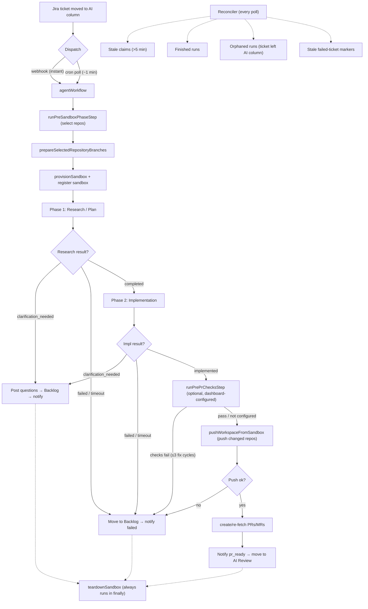

# ai workflow

A workflow-driven AI coding automation service that turns Jira tickets into merge-ready pull requests. ai workflow polls your issue tracker for tickets assigned to AI, implements features end-to-end inside isolated [Vercel Sandboxes](https://vercel.com/docs/sandbox), and delivers PRs for human approval — no manual intervention required.

Designed to work with **Vercel infrastructure**: bring your own API keys (Jira, GitHub, Slack, Anthropic) and deploy onto Vercel — Functions for the HTTP server, Workflows for durable orchestration, and Sandboxes for isolated agent execution.

## Repository Layout

This is a [pnpm workspace](https://pnpm.io/workspaces) monorepo. The workspace globs `apps/*` (see [`pnpm-workspace.yaml`](./pnpm-workspace.yaml)):

```text
ai-workflow/
├── apps/
│   ├── worker/      # The bot — Nitro HTTP server + Vercel Workflows + Sandbox orchestration
│   ├── dashboard/   # The cockpit — Next.js observability and admin UI
│   └── shared/      # Built packages (@shared/contracts, @shared/conditions) shared between worker and dashboard
├── docs/            # Specs, plans, and integration guides
├── pnpm-workspace.yaml
└── package.json     # Root scripts that fan out across the workspace
```

| Package | Name | What it is |
|---------|------|-----------|
| `apps/worker` | `worker` | The actual automation service: Nitro server, durable workflow, sandbox lifecycle, Jira/VCS/Slack adapters. This is what you deploy to run the bot. Everything in the [Workflow Deep-dive](#workflow-deep-dive) below lives here, under `apps/worker/src/`. |
| `apps/dashboard` | `ai-workflow-dashboard` | A Next.js "cockpit" that visualizes runs, KPIs, cost & usage, Arthur eval health, the prompt library, and dashboard user administration. It proxies worker APIs server-side and stores only the worker-issued dashboard session cookie. Optional: the bot runs fine without it. |
| `apps/shared` | `@shared/contracts`, `@shared/conditions` | Built workspace packages: `contracts` holds the shared TypeScript types (`domain.ts`, `api.ts`, `workflow-graph.ts`) describing the worker's API responses and workflow block graph, so the dashboard and worker stay in sync at the type level; `conditions` holds the branch-condition parser/evaluator both apps use. |

### How the packages connect

- **`@shared/contracts` and `@shared/conditions` are built workspace packages, not path aliases.** Each lives under `apps/shared/*` with its own `package.json`, compiles with `tsc -p tsconfig.build.json` to `dist/`, and is declared as a `workspace:*` dependency in `apps/worker/package.json` and `apps/dashboard/package.json`. Both apps run `pnpm build:shared` (`pnpm --filter @shared/contracts build && pnpm --filter @shared/conditions build`) before `dev`/`build`/`test`/`typecheck`, then import the compiled output normally (`import type { RunsResponse } from "@shared/contracts"`), resolved through pnpm's workspace `node_modules` symlinks and each package's own `dist/index.d.ts`, no tsconfig path alias needed.
- **The dashboard talks to the worker over HTTP.** The worker exposes the dashboard API under `/api/v1/*` (`apps/worker/src/routes/api/v1/`), gated by [`apps/worker/src/middleware/api-auth.ts`](./apps/worker/src/middleware/api-auth.ts) on a valid **Better Auth session**. Human login lives on the worker (`/api/auth/**`, `apps/worker/src/auth.ts`); the dashboard is a thin BFF that stores the worker-issued session token in a first-party `httpOnly` cookie. Browser requests go to the dashboard, and the Next server forwards the session to the worker as `Authorization: Bearer <token>`. The two apps deploy as **separate Vercel projects** and share only the `@shared/contracts` and `@shared/conditions` packages.

### Dashboard auth configuration

Password-only dashboard login is valid with just `DASHBOARD_AUTH_EMAIL` and `DASHBOARD_AUTH_PASSWORD` on the worker. The fixed organization defaults to `DASHBOARD_ORG_NAME=AI Workflow` and `DASHBOARD_ORG_SLUG=ai-workflow`.

SSO is optional. To enable it, set the complete worker env group: `SSO_ISSUER`, `SSO_ALLOWED_DOMAIN`, `SSO_CLIENT_ID`, and `SSO_CLIENT_SECRET`. Leaving all four unset keeps password-only mode.

Resend is optional until email delivery is enabled. `RESEND_API_KEY` requires `RESEND_FROM_EMAIL`; `RESEND_WEBHOOK_SECRET` requires `RESEND_API_KEY`.

### Working in the monorepo

Install once at the root; pnpm installs every workspace:

```bash
pnpm install
```

Root scripts in [`package.json`](./package.json) fan out across the workspace:

| Command | What it does |
|---------|-------------|
| `pnpm dev` | Runs the worker in dev (`pnpm --filter worker dev`) |
| `pnpm dev:dashboard` | Runs the dashboard in dev (`pnpm --filter ai-workflow-dashboard dev`) |
| `pnpm dev:all` | Runs every app's dev server in parallel |
| `pnpm build` | `pnpm -r build` — builds every app |
| `pnpm typecheck` | `pnpm -r typecheck` — typechecks every app (validates the `@shared` contracts on both sides) |
| `pnpm test` | `pnpm -r test` — runs each app's unit tests |
| `pnpm test:e2e` | Runs the worker's E2E suites (`test:e2e:agent`, `test:e2e:orchestration`, `test:e2e:capacity` run them individually) |

To target a single app, use pnpm's `--filter`: `pnpm --filter worker test`, `pnpm --filter ai-workflow-dashboard build`.

## How It Works

1. **You move a Jira ticket** to the "AI" column on your board
2. **ai workflow dispatches** the ticket — instantly via the Jira webhook, or within ~1 min via the Vercel Cron poller as a fallback
3. **A durable Vercel Workflow** selects the relevant repositories, then runs the agent in phases (research → implementation) inside a single Vercel Sandbox per ticket
4. **The sandbox pushes commits** directly to the selected repository branches, the ticket moves to "AI Review", and your team gets a Slack notification

If the ticket already has workflow-owned PRs/MRs from a previous ai workflow run, the same workflow re-runs and feeds those PR comments, check results, and conflict status into the agent's context. It does not infer ownership from unrelated open PRs/MRs. If the agent can't proceed without human input, it posts clarification questions on the ticket and moves it to Backlog.



## Workflow Definitions

The pipeline above is a **workflow definition**: a graph of typed blocks stored in Postgres, not a hardcoded sequence. The built-in default definition reproduces exactly the research → implementation → checks → PR flow described above, so a fresh install behaves as documented with nothing to author. Editing it is optional.

The dashboard ships a drag-and-drop **workflow editor** that authors that graph: drop blocks onto a canvas, wire their ports, set per-block params, choose a provider/model per agent block, and save. Definitions are versioned with history and one-click restore, validated on save (a graph that could not run is rejected with a precise error instead of failing mid-run), and each run renders **live** on the canvas, with blocks lighting up as the agent reaches them.

**27 block types** are available, in the palette's nine groups:

| Group | Blocks | What it adds |
|-------|--------|-------------|
| Triggers | `trigger_ticket_ai`, `trigger_plan_approved`, `trigger_pr_created`, `trigger_pr_checks_failed`, `trigger_pr_review` | Entry points: a ticket entering the AI column, an approved plan, or a PR/MR event on a workflow-owned branch |
| Agents | `planning_agent`, `implementation_agent`, `review_agent`, `fix_agent`, `generic_agent` | Coding-agent phases in the sandbox, each with its own provider/model |
| Workspace | `prepare_workspace`, `finalize_workspace` | Repository selection, branches, sandbox provisioning; publish + PR |
| Control | `branch`, `loop`, `terminate` | Conditional routing on any earlier block's output, bounded retry, explicit terminal status |
| Human | `send_plan_approval`, `human_question` | Park the run for a human decision and resume when it arrives |
| Ticket | `update_ticket_status`, `post_ticket_comment` | Ticket side effects |
| Version control | `open_pr`, `post_pr_comment`, `fetch_pr_context` | PR/MR side effects and read-back |
| Utility | `run_pre_pr_checks`, `run_checks`, `call_llm`, `send_slack_message` | Checks, a single in-process LLM call, notifications |
| Arthur | `arthur_injection_check` | Optional prompt-injection screen (requires Arthur) |

This expresses flows the fixed two-phase pipeline could not: **PR triggers** (a failing check or a human "request changes" review starts an automated fix run), **plan approval** (the run parks until a human approves the plan, then re-enters straight into implementation), branching on a check result, and bounded retry loops.

**See [docs/workflow-definitions.md](./docs/workflow-definitions.md)** for the definition format, the full block catalog, trigger routing and precedence, and the deprecation of the in-repo YAML pipelines.

## Tech Stack

| Component | Technology | Purpose |
|-----------|-----------|---------|
| Server | [Nitropack](https://nitro.build) | HTTP server framework (Vercel Functions) |
| Orchestration | [Vercel Workflows](https://vercel.com/docs/workflow) | Durable execution — survives crashes and deploys |
| Agent Execution | [Vercel Sandbox](https://vercel.com/docs/sandbox) | Isolated per-ticket environments |
| AI Agent | [Claude Code](https://docs.anthropic.com/en/docs/claude-code) or [OpenAI Codex CLI](https://github.com/openai/codex) | Coding agent (selectable via `AGENT_KIND`) |
| Issue Tracker | Jira REST API | Ticket lifecycle management |
| VCS | GitHub ([Octokit](https://github.com/octokit/rest.js)) or GitLab ([@gitbeaker/rest](https://github.com/jdalrymple/gitbeaker)) | Branches, PRs/MRs, comments |
| Messaging | [Chat SDK](https://github.com/vercel/chat) (`chat` + `@chat-adapter/slack`) | Slack notifications + `/ai-workflow` slash commands |
| Run Registry | [Neon Postgres](https://neon.tech) (via Vercel Marketplace integration) | Atomic claim/release for concurrent runs |
| Tracing (optional) | [Arthur AI Engine](https://www.arthur.ai/) | Per-run prompt/tool tracing inside the sandbox |
| Validation | [Zod](https://zod.dev) | Schema validation for config and agent output |
| Logging | [Pino](https://getpino.io) | Structured JSON logs |
| Testing | [Vitest](https://vitest.dev) | Unit and E2E tests |

## Setup

For installation, environment variables, and deployment instructions, see [SETUP.md](./SETUP.md).

VCS setup guides:

- GitHub App setup: [docs/GITHUB-APP-SETUP.md](./docs/GITHUB-APP-SETUP.md)
- GitLab.com setup: [docs/GITLAB-SETUP.md](./docs/GITLAB-SETUP.md)

## Workflow Deep-dive

### One workflow, two phases

There is a single durable workflow — `agentWorkflow` in [`apps/worker/src/workflows/agent.ts`](./apps/worker/src/workflows/agent.ts) — that handles both fresh tickets and review-fix re-runs. The branching happens at *context-assembly* time, not at the workflow level: if an open PR for `blazebot/{ticket-key}` already exists, its comments, check results, and conflict status are folded into the agent's input.

> The step table below walks the **default definition**'s shape, which is the two-phase pipeline most runs take. The phases are blocks in a graph, not a hardcoded sequence: a saved definition can add, remove, or reorder them, and can enter from a PR event or a plan approval instead of a ticket. See [Workflow Definitions](#workflow-definitions) above and [docs/workflow-definitions.md](./docs/workflow-definitions.md). `agentWorkflow` is the durable host in every case, so the sandbox, registry, and teardown mechanics described here apply to any definition.

| Step | What happens |
|------|-------------|
| `fetchAndValidateTicket` | Fetches the ticket from Jira; aborts if it's no longer in the AI column |
| `fetchAttachments` | Downloads ticket attachments (size/count limited by `ATTACHMENT_*` env vars) |
| `runPreSandboxPhaseStep` | Runs configured pre-sandbox steps; repository selection chooses the repos the run may edit and includes workflow-owned branches for this ticket by default |
| `prepareSelectedRepositoryBranches` | Creates/reuses the per-repository `blazebot/{ticket-key}` branch (ticket key lowercased) and records AI Workflow branch ownership in Postgres |
| `fetchSelectedRepositoryPRContexts` | For each selected repository with a workflow-owned PR/MR, loads review comments, check results, and conflict status |
| `ensureArthurTaskForTicket` | Optional — creates an Arthur trace task when `GENAI_ENGINE_*` is configured |
| `resolveAgentKindOverride` | Per-ticket override via labels (e.g. `agent:codex`); falls back to `AGENT_KIND` |
| `provisionSandbox` | Provisions a Vercel Sandbox with the first selected repo at `/vercel/sandbox`, clones additional repos under `/vercel/sandbox/repos/`, writes the workspace manifest, installs the agent CLI + skills, and configures auth + Arthur tracer |
| `registerTicketSandbox` | Pins the sandbox id to the ticket in Postgres so cleanup paths can stop it by id |
| `writeAttachments` | Writes downloaded attachments under `/tmp/attachments/` inside the sandbox |
| **Phase 1 — Research/Plan** | `setCommitGuardStep(false)` → `planPhaseStep("research")` → `writeAndStartPhase` → `pollUntilDone` (20 min) → `collectPhase` → `parseResearchStep`. Result is `completed`, `clarification_needed`, or `failed` |
| **Phase 2 — Implementation** | `setCommitGuardStep(true)` → `planPhaseStep("impl", AGENT_SCHEMA)` → `writeAndStartPhase` → `pollUntilDone` (35 min) → `collectPhase` → `parseAgentOutputStep` |
| `runPrePrChecksStep` | Optional — runs dashboard-configured pre-PR check commands (cockpit → Pre-PR checks) for changed repositories before branch push / PR creation; failed checks trigger up to 3 agent fix cycles, then block publication |
| `pushWorkspaceFromSandbox` | Reads the workspace manifest, injects the VCS token after the agent process is dead, and force-pushes only repositories whose HEAD changed |
| `unregisterRun` | Removes the ticket from the Postgres run registry (on the success path, just before PR creation) |
| `createOrUseWorkflowOwnedPullRequestsForRepos` | Opens or reuses PRs/MRs for changed workflow-owned branches |
| `notifyTicket("pr_ready")` → `moveTicket` | Sends the Slack notification with the usage report, then moves the ticket to "AI Review" |
| `teardownSandbox` | Always runs in `finally` — destroys the sandbox regardless of outcome |

If either phase returns `clarification_needed`, the workflow posts numbered questions as a Jira comment, moves the ticket to Backlog, and emits a `needs_clarification` Slack event. If a phase fails or times out, the ticket is moved to Backlog with a `failed` event.

> A third "Review" phase is implemented in `agent.ts` and runs when the active workflow definition contains a `review_agent` block. `ENABLE_REVIEW_PHASE` (default `false`) only controls whether the built-in default definition includes that block; once a definition is saved from the dashboard, the flag has no runtime effect. When the block runs, the agent self-reviews its diff and fixes issues before push (15 min poll cap, `REVIEW_SCHEMA` for structured output).

### Sandbox Lifecycle

Each agent run gets a fresh, isolated [Vercel Sandbox](https://vercel.com/docs/sandbox) — a Firecracker microVM with no access to production infrastructure or other tickets.

#### What gets passed into the sandbox

| Input | How it's provided |
|-------|-------------------|
| Repository source code | The first selected repository is cloned via the sandbox `git` source at its feature branch; additional selected repositories are cloned under `/vercel/sandbox/repos/`; changed repos are unshallowed before push if needed |
| Auth env vars | `ANTHROPIC_API_KEY` (Claude) or `CODEX_API_KEY` / `CODEX_CHATGPT_OAUTH_TOKEN` (Codex) — written to `/tmp/agent-env.sh` (mode 0600) and sourced by each phase script |
| Model | `CLAUDE_MODEL` or `CODEX_MODEL` baked into the phase wrapper script |
| Per-phase input | `/tmp/research-requirements.md` and `/tmp/impl-requirements.md` — assembled by `assembleResearchPlanContext` / `assembleImplementationContext` |
| Attachments | Written to `/tmp/attachments/<filename>` |
| Git identity | `git config user.name` / `user.email` from `COMMIT_AUTHOR` / `COMMIT_EMAIL` (when unset: auto-derived from the GitHub App, or `ai-workflow-blazity` on GitLab) |
| Agent CLI | `@anthropic-ai/claude-code` (Claude) or `@openai/codex` (Codex), installed globally |
| Skills | Installed via `npx skills add ... -g --agent claude-code codex --copy` to **both** `~/.claude/skills/` and `~/.agents/skills/`. Currently only [`frontend-design`](https://github.com/anthropics/skills) is in `GLOBAL_SKILLS` |
| Arthur tracer (optional) | Python tracer + `~/.claude/arthur_config.json` + hook entries in `~/.claude/settings.json` |

The sandbox runs on **Node.js 24** with a configurable timeout (`JOB_TIMEOUT_MS`, default 30 minutes). On Vercel, OIDC authenticates the sandbox automatically. For local dev, explicit `VERCEL_TOKEN` / `VERCEL_TEAM_ID` / `VERCEL_PROJECT_ID` are needed.

#### How the agent runs

Each phase has its own wrapper script (`/tmp/{phase}-wrapper.sh`) that sources `/tmp/agent-env.sh` and pipes the phase input into the agent CLI:

- **Claude** (`buildPhaseScript` in [`apps/worker/src/sandbox/agents/claude.ts`](./apps/worker/src/sandbox/agents/claude.ts)):
  ```bash
  cat /tmp/{phase}-requirements.md | claude \
    --print --model '<model>' --dangerously-skip-permissions --output-format json \
    [--json-schema '<AGENT_SCHEMA>'] \
    > /tmp/{phase}-stdout.txt 2>/tmp/{phase}-stderr.txt
  ```
- **Codex** (`buildPhaseScript` in [`apps/worker/src/sandbox/agents/codex.ts`](./apps/worker/src/sandbox/agents/codex.ts)) uses `codex exec --model … --dangerously-bypass-approvals-and-sandbox --skip-git-repo-check --json` with `--output-schema` for structured output.

The script ends by writing a sentinel file (`/tmp/{phase}-done`). The workflow polls every 30 seconds via `checkPhaseDone` and suspends between polls — durable across redeploys.

The implementation phase enforces the structured contract:

```json
{
  "result": "implemented | clarification_needed | failed",
  "summary": "What was done",
  "questions": ["Question 1", "Question 2"],
  "error": "What went wrong"
}
```

A **commit-guard stop hook** (toggled per phase via `setCommitGuardStep`) blocks the agent from exiting with uncommitted changes. Phase 1 has it disabled (research only — no commits expected); phase 2 enables it so the implementation phase can't return `result: "implemented"` while leaving the working tree dirty.

#### How changes get pushed

ai workflow pushes from **inside the sandbox**, but only after the agent process has exited. The flow in [`apps/worker/src/sandbox/poll-agent.ts`](./apps/worker/src/sandbox/poll-agent.ts):

1. **Read the workspace manifest** — `/vercel/sandbox/aiw-repos.json` lists each selected repository, its local path, branch name, pre-agent SHA, and the remote head observed when the workspace was prepared.
2. **Preflight every repository** — require a clean tracked, staged, untracked, and conflict-free worktree, then compare each saved `preAgentSha` to its current `HEAD`. No repository is pushed unless every repository passes.
3. **Re-read remote state** — fetch each workflow branch, reject source-PR or remote-head drift, and durably record the exact expected remote SHA plus the local target SHA before the first push.
4. **Inject the token per push** — the token is passed as an `http.extraHeader` authorization header on the push command itself, never written to the remote URL or disk. The agent process is already dead at this point and never sees the token; after a successful push, `origin` is reset to the token-less clone URL.
5. **Push changed repositories with an exact lease** — `git -C <repo> push --force-with-lease=refs/heads/{branch}:{expectedSha} origin HEAD:refs/heads/{branch}`.

Remote drift, lease rejection, and other push failures are terminal; the agent is not asked to rewrite the push. Finalize Workspace emits the exact finalized branch metadata directly to Open PR/MR. Workflow step retries are safe because the publisher recognizes the exact target head and every mutation uses an exact lease; a partial publication creates no PRs and cannot be reported as success.

#### How PRs are created

For changed repositories without an existing workflow-owned PR/MR record, the workflow opens one via the VCS adapter (`octokit.pulls.create()` for GitHub, `@gitbeaker/rest` for GitLab):
- **Head**: `blazebot/{ticket-key}`
- **Base**: the selected repository's default/base branch
- **Title**: the ticket title

For repositories that already had a workflow-owned PR/MR record, no new PR/MR is created — the existing one is updated by the force-push and reused for notifications.

#### Teardown

The sandbox is **always destroyed** after each run (in a `finally` block), whether the agent succeeded, failed, or timed out. Every run starts and ends with a clean slate.

### Post-PR Gate

PR creation isn't the end of the pipeline. A separate durable workflow — `postPrGateWorkflow` in [`apps/worker/src/workflows/post-pr-gate.ts`](./apps/worker/src/workflows/post-pr-gate.ts) — is triggered by GitHub/GitLab webhooks on workflow-owned `blazebot/*` branches and runs configurable checks against the PR, surfacing each step as a check run / commit status on the head SHA. Steps are configured via `post-pr-gate.yaml` (v1 ships `pr-title-format` and `code-hygiene`); locking, dedupe, and force-push handling live in the Postgres gate tables. See [docs/post-pr-gate-spec.md](./docs/post-pr-gate-spec.md).

> **`post-pr-gate.yaml` is deprecated.** PR-trigger definitions now absorb the gate: on a bot PR, a matched enabled definition supersedes it (gate precedence). The file is optional, and when absent the loader returns a built-in default equal to the previously shipped YAML. A present file whose content differs from that default still loads, but logs a `post_pr_gate_yaml_deprecated` warning. The gate itself still runs for non-bot PRs and for PRs with no matching definition. See [docs/workflow-definitions.md](./docs/workflow-definitions.md).

### Run Registry and Reconciliation

ai workflow uses an **atomic claim pattern** via Postgres (`INSERT … ON CONFLICT DO NOTHING`) to prevent duplicate runs:

- When a ticket is dispatched, a `claiming:{timestamp}` sentinel is set atomically (`INSERT … ON CONFLICT DO NOTHING`)
- Only one poller instance can win the claim — others see it's taken
- After the workflow starts, the sentinel is replaced with the real workflow run ID and the sandbox id is pinned to the ticket
- On every poll cycle, the **reconciler** ([`apps/worker/src/lib/reconcile.ts`](./apps/worker/src/lib/reconcile.ts)) cleans up:
  - Stale claims older than 5 minutes (kills any orphaned sandbox + clears the sentinel)
  - Finished runs still tracked in the registry (status `completed` / `failed` / `cancelled`)
  - Orphaned runs for tickets that left the AI column — cancels the workflow and stops the sandbox
  - Stale failed-ticket markers (cleared once the ticket leaves the AI column)
  - A 30-second grace window guards against Jira's JQL index lag during column transitions

## License

MIT
