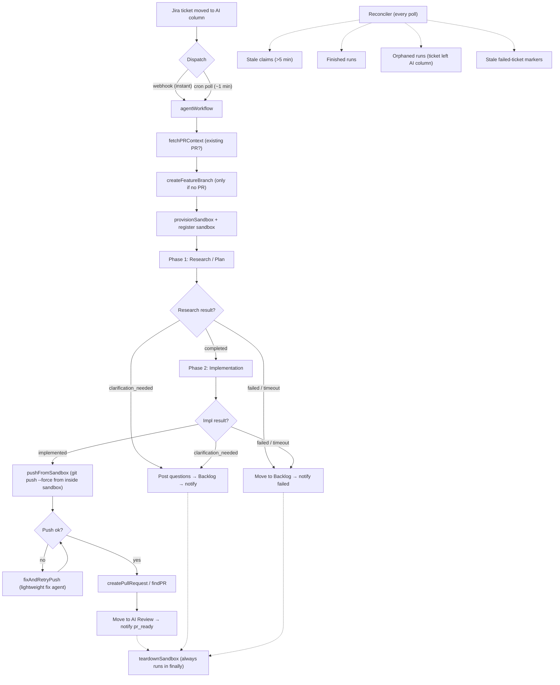

# ai workflow

A workflow-driven AI coding automation service that turns Jira tickets into merge-ready pull requests. ai workflow polls your issue tracker for tickets assigned to AI, implements features end-to-end inside isolated [Vercel Sandboxes](https://vercel.com/docs/sandbox), and delivers PRs for human approval — no manual intervention required.

Designed to work with **Vercel infrastructure**: bring your own API keys (Jira, GitHub, Slack, Anthropic) and deploy onto Vercel — Functions for the HTTP server, Workflows for durable orchestration, and Sandboxes for isolated agent execution.

## Repository Layout

This is a [pnpm workspace](https://pnpm.io/workspaces) monorepo. The workspace globs `apps/*` (see [`pnpm-workspace.yaml`](./pnpm-workspace.yaml)):

```text
ai-workflow/
├── apps/
│   ├── worker/      # The bot — Nitro HTTP server + Vercel Workflows + Sandbox orchestration
│   ├── dashboard/   # The cockpit — Next.js observability and admin UI
│   └── shared/      # Type-only contracts shared between worker and dashboard
├── docs/            # Specs, plans, and integration guides
├── pnpm-workspace.yaml
└── package.json     # Root scripts that fan out across the workspace
```

| Package | Name | What it is |
|---------|------|-----------|
| `apps/worker` | `worker` | The actual automation service: Nitro server, durable workflow, sandbox lifecycle, Jira/VCS/Slack adapters. This is what you deploy to run the bot. Everything in the [Workflow Deep-dive](#workflow-deep-dive) below lives here, under `apps/worker/src/`. |
| `apps/dashboard` | `ai-workflow-dashboard` | A Next.js "cockpit" that visualizes runs, KPIs, eval health, and dashboard user administration. It proxies worker APIs server-side and stores only the worker-issued dashboard session cookie. Optional: the bot runs fine without it. |
| `apps/shared` | _(no package — see below)_ | Shared TypeScript contracts (`domain.ts`, `api.ts`) describing the worker's API responses, so the dashboard and worker stay in sync at the type level. |

### How the packages connect

- **`@shared/*` is a path alias, not an npm package.** `apps/shared` has no `package.json` and emits nothing (`noEmit: true`). Both apps map `@shared/*` → `../shared/*` in their `tsconfig.json` and import the contracts directly from source (`import type { RunsResponse } from "@shared/contracts"`). It's a type-only seam — no build step, no version to bump.
- **The dashboard talks to the worker over HTTP.** The worker exposes the dashboard API under `/api/v1/*` (`apps/worker/src/routes/api/v1/`), gated by [`apps/worker/src/middleware/api-auth.ts`](./apps/worker/src/middleware/api-auth.ts) on a valid **Better Auth session**. Human login lives on the worker (`/api/auth/**`, `apps/worker/src/auth.ts`); the dashboard is a thin BFF that stores the worker-issued session token in a first-party `httpOnly` cookie. Browser requests go to the dashboard, and the Next server forwards the session to the worker as `Authorization: Bearer <token>`. The two apps deploy as **separate Vercel projects** and share only the `@shared/contracts` types.

### Dashboard auth configuration

Password-only dashboard login is valid with just `DASHBOARD_AUTH_EMAIL` and `DASHBOARD_AUTH_PASSWORD` on the worker. The fixed organization defaults to `DASHBOARD_ORG_NAME=AI Workflow` and `DASHBOARD_ORG_SLUG=ai-workflow`.

SSO is optional. To enable it, set the complete worker env group: `SSO_ISSUER`, `SSO_ALLOWED_DOMAIN`, `SSO_CLIENT_ID`, and `SSO_CLIENT_SECRET`. Leaving all four unset keeps password-only mode.

Resend is optional until email delivery is enabled. `RESEND_API_KEY` requires `RESEND_FROM_EMAIL`; `RESEND_WEBHOOK_SECRET` requires `RESEND_API_KEY`.

### Working in the monorepo

Install once at the root; pnpm installs every workspace:

```bash
pnpm install
```

Root scripts in [`package.json`](./package.json) fan out across the workspace:

| Command | What it does |
|---------|-------------|
| `pnpm dev` | Runs the worker in dev (`pnpm --filter worker dev`). Run the dashboard with `pnpm --filter ai-workflow-dashboard dev`. |
| `pnpm build` | `pnpm -r build` — builds every app |
| `pnpm typecheck` | `pnpm -r typecheck` — typechecks every app (validates the `@shared` contracts on both sides) |
| `pnpm test` | `pnpm -r test` — runs each app's unit tests |
| `pnpm test:e2e` | Runs the worker's E2E suites |

To target a single app, use pnpm's `--filter`: `pnpm --filter worker test`, `pnpm --filter ai-workflow-dashboard build`.

## How It Works

1. **You move a Jira ticket** to the "AI" column on your board
2. **ai workflow dispatches** the ticket — instantly via the Jira webhook, or within ~1 min via the Vercel Cron poller as a fallback
3. **A durable Vercel Workflow** runs the agent in phases (research → implementation) inside a single Vercel Sandbox per ticket
4. **The sandbox pushes commits** directly to the feature branch, the ticket moves to "AI Review", and your team gets a Slack notification

If the ticket already has an open PR (review feedback), the same workflow re-runs and feeds the PR comments + conflict status into the agent's context. If the agent can't proceed without human input, it posts clarification questions on the ticket and moves it to Backlog.



## Tech Stack

| Component | Technology | Purpose |
|-----------|-----------|---------|
| Server | [Nitropack](https://nitro.build) | HTTP server framework (Vercel Functions) |
| Orchestration | [Vercel Workflows](https://vercel.com/docs/workflow) | Durable execution — survives crashes and deploys |
| Agent Execution | [Vercel Sandbox](https://vercel.com/docs/sandbox) | Isolated per-ticket environments |
| AI Agent | [Claude Code](https://docs.anthropic.com/en/docs/claude-code) or [OpenAI Codex CLI](https://github.com/openai/codex) | Coding agent (selectable via `AGENT_KIND`) |
| Issue Tracker | Jira REST API | Ticket lifecycle management |
| VCS | GitHub ([Octokit](https://github.com/octokit/rest.js)) or GitLab ([@gitbeaker/rest](https://github.com/jdalrymple/gitbeaker)) | Branches, PRs/MRs, comments |
| Messaging | [Chat SDK](https://chat-sdk.dev) + Slack | Team notifications + `/ai-workflow` slash commands |
| Run Registry | [Neon Postgres](https://neon.tech) (via Vercel Marketplace integration) | Atomic claim/release for concurrent runs |
| Tracing (optional) | [Arthur AI Engine](https://www.arthur.ai/) | Per-run prompt/tool tracing inside the sandbox |
| Validation | [Zod](https://zod.dev) | Schema validation for config and agent output |
| Logging | [Pino](https://getpino.io) | Structured JSON logs |
| Testing | [Vitest](https://vitest.dev) | Unit and E2E tests |

## Setup

For installation, environment variables, and deployment instructions, see [SETUP.md](./SETUP.md).

VCS setup guides:

- GitHub App setup: [docs/GITHUB-APP-SETUP.md](./docs/GITHUB-APP-SETUP.md)
- GitLab.com setup: [docs/GITLAB-SETUP.md](./docs/GITLAB-SETUP.md)

## Workflow Deep-dive

### One workflow, two phases

There is a single durable workflow — `agentWorkflow` in [`apps/worker/src/workflows/agent.ts`](./apps/worker/src/workflows/agent.ts) — that handles both fresh tickets and review-fix re-runs. The branching happens at *context-assembly* time, not at the workflow level: if an open PR for `blazebot/{ticket-key}` already exists, its comments, check results, and conflict status are folded into the agent's input.

| Step | What happens |
|------|-------------|
| `fetchAndValidateTicket` | Fetches the ticket from Jira; aborts if it's no longer in the AI column |
| `fetchPRContext` | Looks up an open PR for `blazebot/{ticket-key}`; returns comments, check results, conflict status (or `null` for fresh tickets) |
| `createFeatureBranch` | Only when there's no existing PR — creates/resets `blazebot/{ticket-key}` from the base branch |
| `fetchAttachments` | Downloads ticket attachments (size/count limited by `ATTACHMENT_*` env vars) |
| `ensureArthurTaskForTicket` | Optional — creates an Arthur trace task when `GENAI_ENGINE_*` is configured |
| `resolveAgentKindOverride` | Per-ticket override via labels (e.g. `agent:codex`); falls back to `AGENT_KIND` |
| `provisionSandbox` | Provisions a Vercel Sandbox, installs the agent CLI + skills, configures auth + Arthur tracer |
| `registerTicketSandbox` | Pins the sandbox id to the ticket in Postgres so cleanup paths can stop it by id |
| `writeAttachments` | Writes downloaded attachments under `/tmp/attachments/` inside the sandbox |
| **Phase 1 — Research/Plan** | `setCommitGuardStep(false)` → `planPhaseStep("research")` → `writeAndStartPhase` → `pollUntilDone` (20 min) → `collectPhase` → `parseResearchStep`. Result is `completed`, `clarification_needed`, or `failed` |
| **Phase 2 — Implementation** | `setCommitGuardStep(true)` → `planPhaseStep("impl", AGENT_SCHEMA)` → `writeAndStartPhase` → `pollUntilDone` (35 min) → `collectPhase` → `parseAgentOutputStep` |
| `pushFromSandbox` | Injects the VCS token into the sandbox's git remote (after the agent process is dead) and runs `git push --force` from inside the sandbox |
| `fixAndRetryPush` | Fallback: if the push is rejected (e.g. pre-receive hook), spawns a lightweight fix agent in the same sandbox, then retries the push once |
| `createPullRequest` / `findPRForBranch` | Opens a new PR (no prior PR) or re-fetches the existing PR (review-fix path) |
| `moveTicket` → `notifyTicket("pr_ready")` | Moves the ticket to "AI Review" and sends the Slack notification with the usage report |
| `unregisterRun` | Removes the ticket from the Postgres run registry |
| `teardownSandbox` | Always runs in `finally` — destroys the sandbox regardless of outcome |

If either phase returns `clarification_needed`, the workflow posts numbered questions as a Jira comment, moves the ticket to Backlog, and emits a `needs_clarification` Slack event. If a phase fails or times out, the ticket is moved to Backlog with a `failed` event.

> A third "Review" phase is implemented in `agent.ts` but gated behind `ENABLE_REVIEW_PHASE` (default `false`). When enabled, it runs after Phase 2 — the agent self-reviews its diff and fixes issues before push (15 min poll cap, `REVIEW_SCHEMA` for structured output).

### Sandbox Lifecycle

Each agent run gets a fresh, isolated [Vercel Sandbox](https://vercel.com/docs/sandbox) — a Firecracker microVM with no access to production infrastructure or other tickets.

#### What gets passed into the sandbox

| Input | How it's provided |
|-------|-------------------|
| Repository source code | Cloned via `git` source at the feature branch (shallow `depth=1`); unshallowed before push if needed |
| Auth env vars | `ANTHROPIC_API_KEY` (Claude) or `CODEX_API_KEY` / `CODEX_CHATGPT_OAUTH_TOKEN` (Codex) — written to `/tmp/agent-env.sh` (mode 0600) and sourced by each phase script |
| Model | `CLAUDE_MODEL` or `CODEX_MODEL` baked into the phase wrapper script |
| Per-phase input | `/tmp/research-requirements.md` and `/tmp/impl-requirements.md` — assembled by `assembleResearchPlanContext` / `assembleImplementationContext` |
| Attachments | Written to `/tmp/attachments/<filename>` |
| Git identity | `git config user.name` / `user.email` from `COMMIT_AUTHOR` / `COMMIT_EMAIL` (or auto-derived from the GitHub App when unset) |
| Agent CLI | `@anthropic-ai/claude-code` (Claude) or `@openai/codex` (Codex), installed globally |
| Skills | Installed via `npx skills add ... -g --agent claude-code codex --copy` to **both** `~/.claude/skills/` and `~/.agents/skills/`. Currently only [`frontend-design`](https://github.com/anthropics/skills) is in `GLOBAL_SKILLS` |
| Arthur tracer (optional) | Python tracer + `~/.claude/arthur_config.json` + hook entries in `~/.claude/settings.json` |

The sandbox runs on **Node.js 24** with a configurable timeout (`JOB_TIMEOUT_MS`, default 30 minutes). On Vercel, OIDC authenticates the sandbox automatically. For local dev, explicit `VERCEL_TOKEN` / `VERCEL_TEAM_ID` / `VERCEL_PROJECT_ID` are needed.

#### How the agent runs

Each phase has its own wrapper script (`/tmp/{phase}-wrapper.sh`) that sources `/tmp/agent-env.sh` and pipes the phase input into the agent CLI:

- **Claude** (`buildPhaseScript` in [`apps/worker/src/sandbox/agents/claude.ts`](./apps/worker/src/sandbox/agents/claude.ts)):
  ```bash
  cat /tmp/{phase}-requirements.md | claude \
    --print --model '<model>' --dangerously-skip-permissions --output-format json \
    [--json-schema '<AGENT_SCHEMA>'] \
    > /tmp/{phase}-stdout.txt 2>/tmp/{phase}-stderr.txt
  ```
- **Codex** (`buildPhaseScript` in [`apps/worker/src/sandbox/agents/codex.ts`](./apps/worker/src/sandbox/agents/codex.ts)) uses `codex exec --model … --dangerously-bypass-approvals-and-sandbox --skip-git-repo-check --json` with `--output-schema` for structured output.

The script ends by writing a sentinel file (`/tmp/{phase}-done`). The workflow polls every 30 seconds via `checkPhaseDone` and suspends between polls — durable across redeploys.

The implementation phase enforces the structured contract:

```json
{
  "result": "implemented | clarification_needed | failed",
  "summary": "What was done",
  "questions": ["Question 1", "Question 2"],
  "error": "What went wrong"
}
```

A **commit-guard stop hook** (toggled per phase via `setCommitGuardStep`) blocks the agent from exiting with uncommitted changes. Phase 1 has it disabled (research only — no commits expected); phase 2 enables it so the implementation phase can't return `result: "implemented"` while leaving the working tree dirty.

#### How changes get pushed

ai workflow pushes from **inside the sandbox**, but only after the agent process has exited. The flow in [`apps/worker/src/sandbox/poll-agent.ts`](./apps/worker/src/sandbox/poll-agent.ts):

1. **Verify commits exist** — compare the saved `/tmp/.pre-agent-sha` to the current `HEAD`. If unchanged, the workflow fails the run with "Agent reported success but made no commits."
2. **Inject the token** — `git remote set-url origin <auth-url>`. The agent process is already dead at this point and never sees the token.
3. **Unshallow if needed** — shallow clones miss shared ancestry with `main`, which breaks PR creation.
4. **Push** — `git push --force origin HEAD:refs/heads/{branch}` (force-push is safe; `blazebot/*` branches have no concurrent pushers).

If the push is rejected (e.g. by a remote pre-receive hook), `fixAndRetryPush` strips the token, spawns a smaller fix agent in the same sandbox with the push error as context, lets it commit fixes, then re-injects the token and retries the push once.

#### How PRs are created

For fresh tickets, the workflow opens a PR via the VCS adapter (`octokit.pulls.create()` for GitHub, `@gitbeaker/rest` for GitLab):
- **Head**: `blazebot/{ticket-key}`
- **Base**: `GITHUB_BASE_BRANCH` / `GITLAB_BASE_BRANCH` (default `main`)
- **Title**: the ticket title

For tickets that already had a PR (the review-fix path), no new PR is created — the existing PR is updated by the force-push and re-fetched via `findPRForBranch`.

#### Teardown

The sandbox is **always destroyed** after each run (in a `finally` block), whether the agent succeeded, failed, or timed out. Every run starts and ends with a clean slate.

### Run Registry and Reconciliation

ai workflow uses an **atomic claim pattern** via Postgres (`INSERT … ON CONFLICT DO NOTHING`) to prevent duplicate runs:

- When a ticket is dispatched, a `claiming:{timestamp}` sentinel is set atomically (`INSERT … ON CONFLICT DO NOTHING`)
- Only one poller instance can win the claim — others see it's taken
- After the workflow starts, the sentinel is replaced with the real workflow run ID and the sandbox id is pinned to the ticket
- On every poll cycle, the **reconciler** ([`apps/worker/src/lib/reconcile.ts`](./apps/worker/src/lib/reconcile.ts)) cleans up:
  - Stale claims older than 5 minutes (kills any orphaned sandbox + clears the sentinel)
  - Finished runs still tracked in the registry (status `completed` / `failed` / `cancelled`)
  - Orphaned runs for tickets that left the AI column — cancels the workflow and stops the sandbox
  - Stale failed-ticket markers (cleared once the ticket leaves the AI column)
  - A 30-second grace window guards against Jira's JQL index lag during column transitions

## License

MIT
