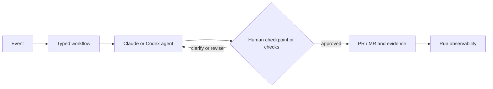

# AI Workflow

**Turn engineering events into inspectable, human-controlled agent workflows—and ship evidence-backed changes through the tools your team already uses.**

[](./LICENSE.md)


AI Workflow is free, open source, and actively being built.

<div align="center"><video src="https://github.com/user-attachments/assets/fb636bcb-482a-4d78-a63d-779c22fb1e3c" width="800" controls></video></div>

## What It Is

AI Workflow is a platform for building and operating engineering-agent workflows. It turns issues, messages, alerts, webhooks, and schedules into visible multi-step runs that can research, ask for clarification, wait for approval, write code, open pull requests, respond to review, and show the evidence behind every result.

Most coding-agent tools optimize a single prompt or task. Engineering organizations need the layer around the agent: event routing, repeatable workflows, human control, delivery adapters, observability, and a way to improve successful patterns across teams. AI Workflow provides that control plane without replacing the tools your teams already trust.

## Why AI Workflow

| Principle | Benefit |
|---|---|
| **🔍 Inspectable by default** | See and customize every workflow step, prompt, decision, and artifact. No black box. |
| **🧭 Human checkpoints** | Ask for missing context, approve plans, and gate delivery at explicit points. |
| **🔌 Keep your tools** | Connect existing issue trackers, chat, alerts, repositories, and coding agents through adapters. |
| **📈 Learn as an organization** | Version workflows, govern execution, compare outcomes, and promote what works across teams. |

## From Event to Evidence



## Use Cases

- **🚨 Severity response:** classify an alert, gather context, and route the right workflow.
- **🔬 Investigation and research:** inspect code, issues, incidents, and documentation before recommending action.
- **💬 Clarify and bounce:** pause when requirements are incomplete, ask structured questions, and resume with the answer.
- **✅ Plan approval:** produce an implementation plan and wait for an explicit human decision.
- **🛠️ Draft PR:** implement approved work in an isolated environment and open a pull request with evidence.
- **🔁 Review and fix:** react to checks or review feedback, apply changes, and return the work for review.

## Target Capabilities

- Jira and Linear issue triggers and lifecycle updates.
- Slack messages, alerts, webhooks, and schedules as workflow inputs.
- GitHub and GitLab delivery through pull requests and merge requests.
- Claude and Codex as interchangeable execution agents.
- Visual, typed, multi-step workflows with branching, loops, and human steps.
- Prompt and workflow versioning with history, comparison, and restoration.
- Per-run monitoring for steps, outcomes, timing, model usage, and artifacts.
- Promotion of proven workflows plus team and outcome performance views.
- Customer-controlled deployment, data, credentials, and execution infrastructure.

## How AI Workflow Is Different

Legend: ✅ native/current · ◐ partial, adjacent, or tier-dependent · — not publicly documented / not the product focus.

Based on publicly documented capabilities, reviewed July 2026. Availability can vary by plan or deployment.

| Product | Open-source core | Customer-controlled application deployment | Visual multi-step workflow graph | Jira → PR | GitHub + GitLab delivery | Structured human clarification/approval | Per-run step and usage telemetry |
|---|:---:|:---:|:---:|:---:|:---:|:---:|:---:|
| **AI Workflow** | ✅ | ✅ | ✅ | ✅ | ✅ | ✅ | ✅ |
| [Claude Tag](https://claude.com/product/tag) | — | — | — | — | ◐ | ◐ | ◐ |
| [Ellipsis](https://docs.ellipsis.dev/) | — | ◐ | ◐ | — | — | ◐ | ✅ |
| [Tembo](https://docs.tembo.io/) | — | ✅ | ◐ | ✅ | ✅ | ◐ | ◐ |
| [OpenHands](https://docs.openhands.dev/) | ✅ | ✅ | ◐ | ◐ | ✅ | ✅ | ✅ |
| [Rovo Dev](https://www.atlassian.com/software/rovo-dev) | — | — | ◐ | ✅ | — | ◐ | ◐ |
| [DX](https://getdx.com/) | — | ◐ | ◐ | ◐ | ◐ | ✅ | ✅ |
| [LinearB](https://linearb.io/) | — | — | ◐ | — | ◐ | ✅ | ◐ |
| [Swarmia](https://www.swarmia.com/) | — | — | — | — | — | — | ◐ |
| [Jellyfish](https://jellyfish.co/platform/engineering-management-platform/) | — | — | — | — | — | — | ◐ |

Engineering-intelligence products such as DX, LinearB, Swarmia, and Jellyfish are adjacent: they help teams measure or improve engineering systems, but are not full agent-workflow runtimes.

## Architecture and Deployment

AI Workflow separates event adapters, typed workflow definitions, durable orchestration, isolated agent execution, delivery adapters, and observability. A run keeps its inputs, step state, human decisions, outputs, usage, and delivery evidence connected from trigger to outcome.

The customer-controlled deployment target uses Vercel for the application and durable workflows, Neon Postgres for workflow and run state, and Vercel Sandbox for isolated agent execution. The open-source dashboard provides workflow authoring, run inspection, usage visibility, and operational controls.

```text
Issue, message, alert, webhook, schedule
                    ↓
             Event adapters
                    ↓
        Typed, versioned workflow
                    ↓
      Claude / Codex in a sandbox
                    ↓
       Human and automated gates
                    ↓
       GitHub / GitLab + evidence
                    ↓
          Observability dashboard
```

See [workflow definitions](./docs/workflow-definitions.md) for the graph model and block catalog.

## Get Started

Follow [SETUP.md](./SETUP.md) for local development, environment variables, and deployment.

Version-control setup:

- [GitHub App setup](./docs/GITHUB-APP-SETUP.md)
- [GitLab setup](./docs/GITLAB-SETUP.md)

## Repository Map

```text
ai-workflow/
├── apps/
│   ├── worker/      # Events, orchestration, agents, adapters, and APIs
│   ├── dashboard/   # Workflow authoring, observability, and administration
│   └── shared/      # Shared contracts and workflow conditions
├── docs/            # Product, integration, deployment, and testing guides
├── SETUP.md
└── package.json
```

## Contributing

This repository is a pnpm workspace. From the repository root:

```bash
pnpm install
pnpm dev
pnpm dev:dashboard
pnpm typecheck
pnpm test
pnpm build
```

## Roadmap

> **Work in progress.**

- Broader adapter coverage for Linear, Slack, alerts, webhooks, and schedules.
- Governance for audit history, policy enforcement, and execution budgets.
- Native prompt lifecycle management.
- Organization-wide promotion, canary rollout, and rollback for workflows.
- Team and outcome analytics.
- Portable deployment beyond Vercel.

Priorities may change as the project develops.

## License

AI Workflow is free and open source under the [MIT License](./LICENSE.md).
