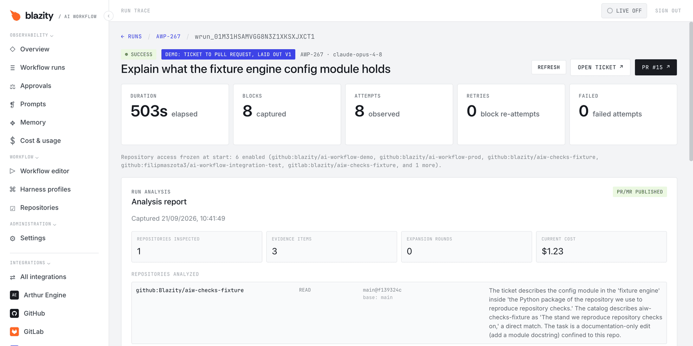
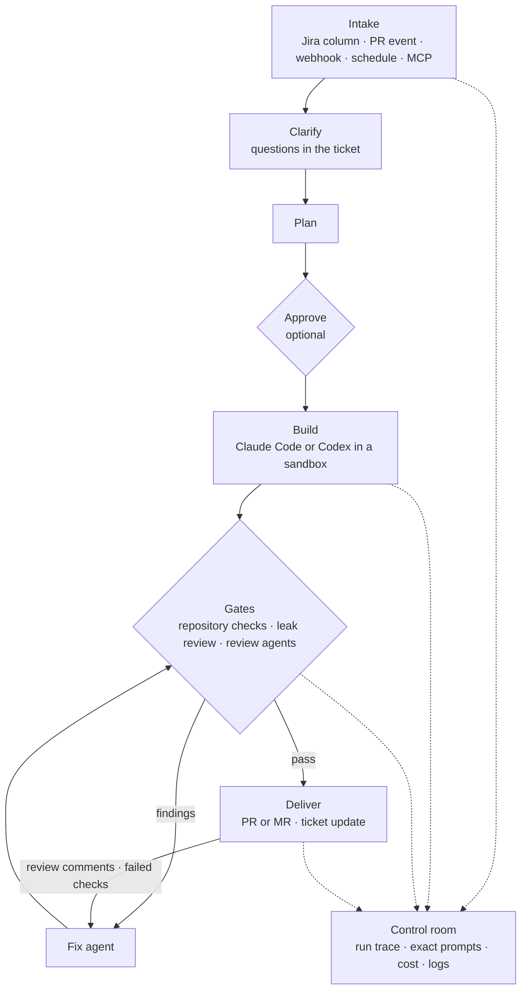
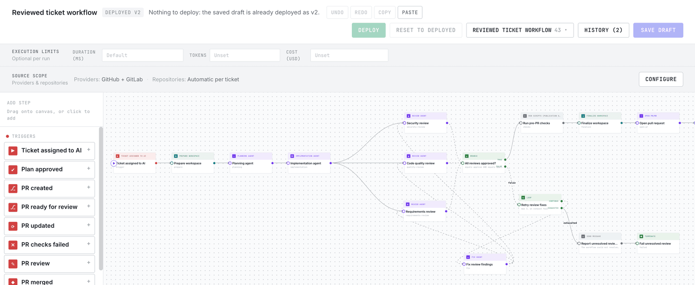
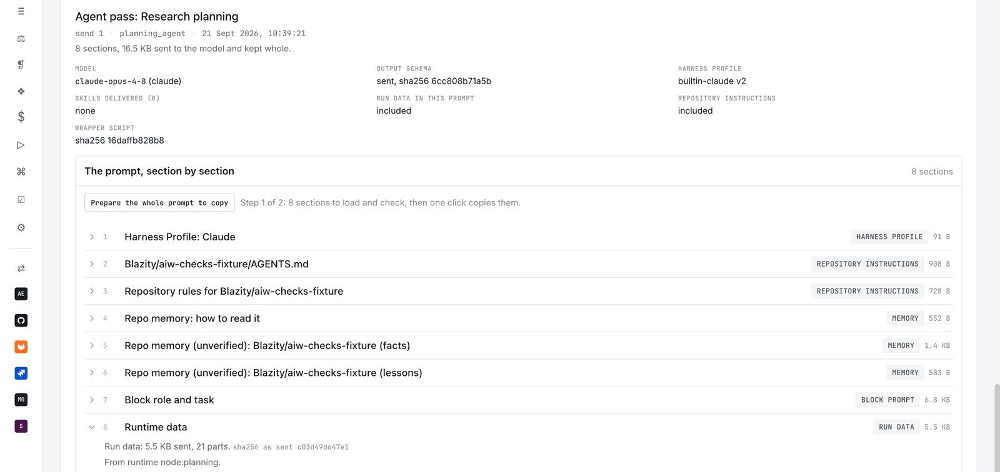

Status: current
Last-verified: 2026-10-09

# AI Workflow

**Build your own software factory, with the lights on.**

AI Workflow is an open-source platform that turns Jira tickets and pull request events into reviewed pull requests. Claude Code or Codex plans, asks questions, writes code, runs your checks and fixes findings inside an isolated sandbox, following workflows you design and version. You can see every step, every prompt, every decision and what each run cost. MIT licensed, deployed on your own Vercel and Neon.

[Quickstart](#quickstart) · [Build your factory](./docs/guides/build-your-software-factory.md) · [The factory line](#the-factory-line) · [Docs](./docs/index.md) · [Connect your agent over MCP](./SETUP.md#remote-mcp--connect-your-agent)

[](./LICENSE.md)
[](https://github.com/Blazity/ai-workflow/actions/workflows/ci.yml)
[](https://github.com/Blazity/ai-workflow/releases)



## Why a factory with the lights on

Coding agents can write the code. The slow part is now everything around it: picking up the right work, asking what the ticket left out, proving the change works, and reviewing it. A "dark" software factory takes people out of that loop. AI Workflow keeps them at the points you choose: a question in the ticket, a plan to approve, checks that block delivery, and a pull request that a person merges. You set those checkpoints per workflow, and you can read exactly what every agent was told.

AI Workflow has no merge step. Merging stays with a person.

## The factory line


```mermaid
flowchart TD
    A["Intake<br/>Jira column · PR event · webhook · schedule · MCP"] --> B["Clarify<br/>questions in the ticket"]
    B --> C["Plan"]
    C --> D{"Approve<br/>optional"}
    D --> E["Build<br/>Claude Code or Codex in a sandbox"]
    E --> F{"Gates<br/>repository checks · leak review · review agents"}
    F -->|"findings"| G["Fix agent"]
    G --> F
    F -->|"pass"| H["Deliver<br/>PR or MR · ticket update"]
    H -->|"review comments · failed checks"| G
    A -.-> O["Control room<br/>run trace · exact prompts · cost · logs"]
    E -.-> O
    F -.-> O
    H -.-> O
```

1. **Intake.** A ticket enters a Jira column, a pull request is opened, updated or fails its checks, a signed webhook arrives, a schedule fires, or someone starts a run by hand or through MCP.
2. **Clarify and plan.** A planning agent reads the ticket and the repositories it may touch. When something is missing, it asks in the ticket and the run waits for the answer.
3. **Approve.** If the workflow says so, the plan waits in an approval queue until a person approves or rejects it.
4. **Build and gate.** An implementation agent works in an isolated Vercel Sandbox. Your repository's own scripts, a leak review for secrets and review agents decide whether the change can be published. A fix agent works through findings in a bounded loop.
5. **Deliver and rework.** The run opens a pull request or merge request and updates the ticket. Review comments and failed checks start the next round.



Every agent send is recorded. The briefing view shows the prompt section by section, with where each part came from: the harness profile, the repository's `AGENTS.md`, memory, the block's task and the run data.



## What a software factory needs, and what ships today

| Station | In AI Workflow | Status |
|---|---|---|
| Intake | Jira column triggers; GitHub and GitLab pull request events (created, ready, updated, review, checks failed, merged); signed webhooks; cron schedules; manual and MCP dispatch | Shipped |
| Line design | A visual, typed workflow graph with branches, bounded loops and human steps, with drafts, deploys and version history | Shipped |
| Workstations | Planning, implementation, review, fix and generic agents on Claude Code or Codex, configured by versioned harness profiles with skills | Shipped |
| Isolation | Agents run in Vercel Sandbox, in workspaces drawn from a repository catalog that can mix GitHub and GitLab repositories | Shipped |
| Quality gates | Named repository script groups as a publication gate, a leak review for secrets, parallel review agents, and a prompt-injection check when Arthur is connected | Shipped |
| Human checkpoints | Clarifying questions answered in Jira, the dashboard or MCP; a plan approval queue | Shipped |
| Delivery | Pull and merge requests, PR comments, reviews and checks, ticket transitions and comments, Slack messages | Shipped |
| Rework | Workflows that answer review comments and failed checks with a fix agent | Shipped |
| Control room | Run trace, the exact prompt of every agent send, cost and usage per run and per workflow, logs and diagnosis, per-run limits on duration, tokens and cost | Shipped |
| Memory | What agents learn about repositories, kept in the built-in store or in Mem0 | Shipped |
| Remote control | An MCP server that can dispatch runs, answer questions, approve plans, read briefings, and author and publish workflows | Shipped |
| Fleet management | Promoting proven workflows across teams, organization-wide budgets, canary rollout | Planned |
| Run anywhere | Execution outside Vercel | Planned |

## Starter workflows

A new deployment comes with these workflows, and the editor can start a new one from any of them. Only Ticket workflow is switched on; the rest wait until you enable them.

| Workflow | What it does |
|---|---|
| Ticket workflow | Takes a ticket from the AI column to a published pull request: plan, implement, run checks, open the PR. |
| Human-approved plan | Plans first, waits for a person to approve, then implements the approved plan. |
| Reviewed ticket workflow | Implements a ticket, runs security, code quality and requirements reviews in parallel, and retries fixes up to three times. |
| Review & fix after PR | Responds to failed checks or requested changes on pull requests the workflow opened. |
| Post-PR review | Reviews ready and updated pull requests, publishes findings and completes a check on the exact reviewed commit. |
| Post-PR review with autofix | Reviews an open pull request, fixes findings in a bounded loop and publishes one final review. |
| Fully modular | Builds delivery from generic agents, a workspace, checks and a visible branch, as a base for your own line. |
| Ticket triage (webhook) | Triages a support ticket from a signed webhook and opens a fix PR only when the problem is in code. It has no human gate, so add an approval step or accept only a trusted sender. |
| Support investigation (Zendesk + Sentry) | Gathers evidence from the tracker and chat for Zendesk and Sentry events, routes non-code cases to a summary, and gates code fixes behind approval. |

## Choose how much each line does on its own

| Level | The agent | A person | Start from |
|---|---|---|---|
| Review only | Reviews pull requests people wrote | Writes the code and merges | Post-PR review |
| Approve the plan | Plans, waits, implements the approved plan, opens a PR | Approves the plan, reviews and merges | Human-approved plan |
| Approve the PR | Plans, implements, passes your checks and review agents, opens a PR | Reviews and merges | Ticket workflow, Reviewed ticket workflow |
| Self-correcting | Also answers review comments and failed checks with fixes | Merges | Add Review & fix after PR or Post-PR review with autofix |

Each workflow sits at its own level, so a team can let routine tickets run further while risky areas still wait for a plan approval.

## Quickstart

You need:

- A Vercel team (the Pro plan is recommended: sandboxes, cron jobs and durable workflows are paid features on Hobby) and Neon Postgres from the Vercel Marketplace.
- A GitHub App or a GitLab token with access to the repositories the agents may work in.
- An OpenAI key for Codex or an Anthropic key for Claude Code. The starter workflows use the built-in Codex profile; point a node at a Claude profile to switch.
- Jira, if tickets should start the work. Post-PR review runs without it.

Then:

1. Deploy the worker and the dashboard as two Vercel projects, following [SETUP.md, sections 3 to 6](./SETUP.md#3-clone-the-repo-and-link-to-vercel).
2. Sign in to the dashboard, connect GitHub or GitLab under Integrations, and add your repositories under Repositories.
3. Try it without Jira. Open **Post-PR review** in the Workflow editor, press **Run trigger** on its "PR ready for review" node, and paste the URL of a pull request you already have. The review lands on that pull request.
4. When tickets should start the work, connect Jira and enable **Ticket workflow** or **Human-approved plan**.

<details>
<summary>Set it up with Claude Code</summary>

The repository ships setup skills. Open it in Claude Code and run `/init-env`: it links the Vercel project, sets the environment variables for Jira, your VCS, the agent and Neon, deploys, registers the Jira webhook and the Slack command, and runs the smoke checks. `/init-neon`, `/init-vcs`, `/init-agent`, `/init-jira` and `/init-slack` each cover one piece.

</details>

## Drive the factory from your own agent

AI Workflow is also an MCP server. Connect Claude Code, Codex or another MCP client and it can start runs, answer clarifying questions, approve plans, read the exact prompt an agent was sent, diagnose a failed run, and author and publish workflows. OAuth scopes decide which of those a client may do. See [Remote MCP](./SETUP.md#remote-mcp--connect-your-agent).

## How it compares

As of October 2026:

- **Hosted coding agents** such as Devin, Cursor's cloud agents, GitHub Copilot's coding agent and Codex cloud run inside the vendor's product and infrastructure. AI Workflow runs Claude Code and Codex inside workflows you define, on infrastructure you own.
- **Open orchestration projects** are the closest neighbours. [OpenAI Symphony](https://github.com/openai/symphony) "turns project work into isolated, autonomous implementation runs" and works from Linear. [SuperPlane](https://github.com/superplanehq/superplane) calls itself an "open source factory for one-shot engineering" and connects many DevOps tools on a canvas. AI Workflow concentrates on the ticket-to-PR line with Jira, GitHub and GitLab, works in rounds (questions, plan approval, checks, review fixes) rather than one attempt, and records the exact prompt every agent received.
- **Agent runtimes** such as Claude Code, Codex CLI and OpenHands are the workers on the line. AI Workflow runs Claude Code and Codex for you and does not replace them.

## Architecture

AI Workflow is two apps and a database. The worker (Nitro and the Vercel Workflow DevKit) receives events, runs workflow definitions durably, starts agents in Vercel Sandbox, and talks to Jira, GitHub, GitLab and Slack through integration packages. The dashboard (Next.js) is where people author workflows, approve plans, configure integrations and inspect runs. Neon Postgres holds definitions, runs, settings and memory.

Read [workflow definitions](./docs/architecture/workflow-definition.md) for the graph model and the block catalog, [integrations](./docs/architecture/integrations.md) to connect a new provider, and [the documentation index](./docs/index.md) for everything else.

```text
ai-workflow/
├── apps/
│   ├── worker/      # Events, orchestration, agents, adapters, and APIs
│   └── dashboard/   # Workflow authoring, observability, and administration
├── packages/        # Pure code with two consumers: contracts, prompts, agent visibility
├── integrations/    # One package per third party (Jira, Slack, GitHub, GitLab, Arthur, Mem0) plus the SDK
├── docs/            # index.md lists every current document
├── SETUP.md
└── package.json
```

## Security

- Agents work in Vercel Sandbox, not on your machines or CI runners.
- A Leak review block screens the unpushed diff for secrets before anything is published.
- Credentials stay in your own Vercel projects and database. The dashboard holds no integration secrets.
- Report a vulnerability privately as described in [SECURITY.md](./SECURITY.md).

## Contributing

This repository is a pnpm workspace. From the root:

```bash
pnpm install
pnpm dev                 # worker
pnpm dev:dashboard
pnpm run typecheck
pnpm run verify:changed  # the scope-aware gate, before pushing
```

Do not run `pnpm build` locally: the worker build applies database migrations to whatever `DATABASE_URL` points at. [CONTRIBUTING.md](./CONTRIBUTING.md) has the rest, and [AGENTS.md](./AGENTS.md) is the entry point for coding agents.

## Roadmap

The dated priorities are in [the roadmap](./docs/product/roadmap-2026-08-27.md). Next:

- Promoting proven workflows across teams, with team and outcome views.
- Governance: audit history, policy enforcement and organization-wide budgets.
- Running outside Vercel, and more trackers such as Linear.

## License

AI Workflow is free and open source under the [MIT License](./LICENSE.md). It is built by [Blazity](https://blazity.com).
