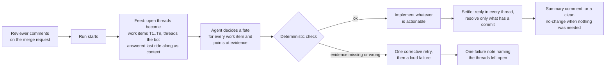
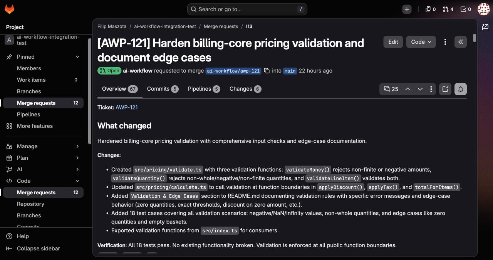
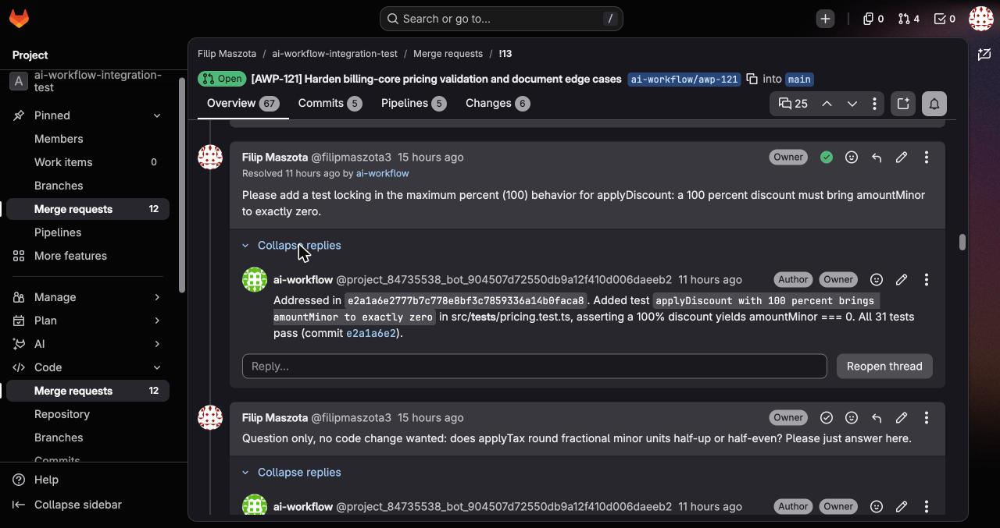
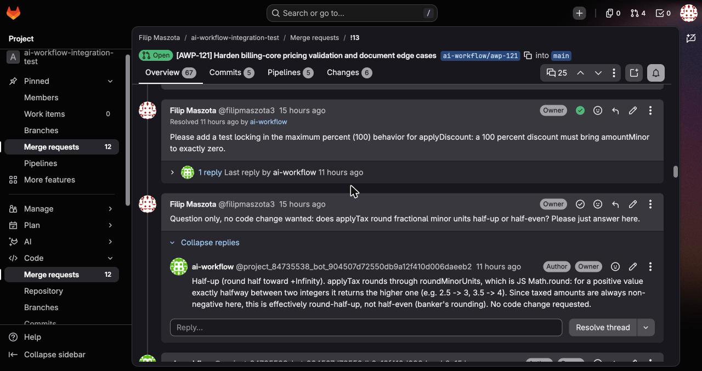
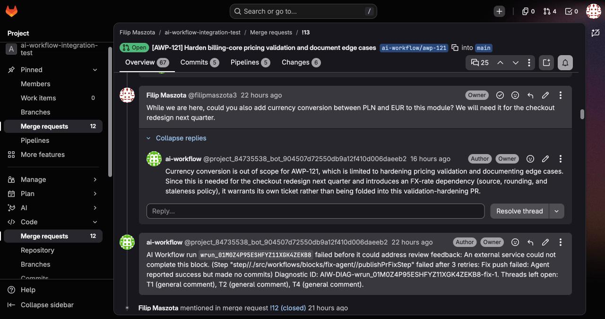
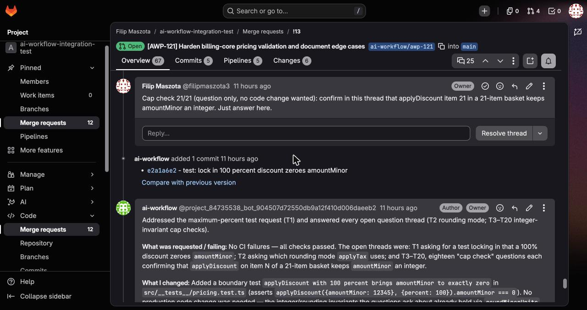
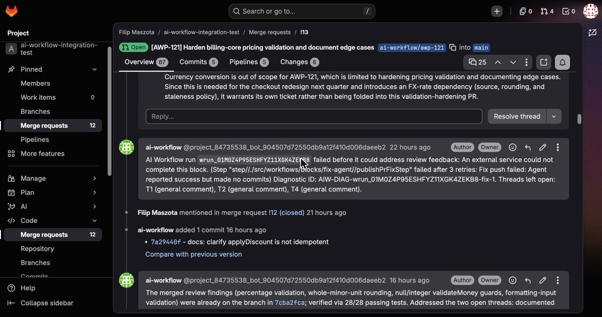

# Review Ledger: what happens when a reviewer comments on a bot's merge request

Since 2026-08-26 the AI Workflow bot treats every review comment on its merge requests as a piece of work with a name, a fate and a receipt. A reviewer who leaves a comment gets an answer in that very thread: a commit hash when something changed, a quote from the code when it was already there, an explanation when it was a question, a reason when it is out of scope. This document explains the idea, shows it on a real merge request, and lists what we verified before calling it done. The full test log sits in the appendix for anyone who wants the evidence line by line.

Tested on GitLab (https://gitlab.com/filipmaszota3/ai-workflow-integration-test, merge request !13) and GitHub (https://github.com/Blazity/aiw-checks-fixture/pull/12). Feature PRs: #345 (the ledger), #349, #350 and #351 (fixes found while testing), all in Blazity/ai-workflow.

## The problem we had

Before this change the bot could see review comments, and it usually acted on them, but it was working blind. Every run received a flat list of all comments on the merge request, including ones it had already handled and ones it had written itself. The model had to work out on its own what was done and what was still owed, nothing answered the reviewer per comment, and when there was nothing left to do the run went red with "Agent reported success but made no commits", which looks exactly like the run where the model simply gave up. A reviewer could not tell whether the bot had noticed a comment, considered it handled, or ignored it.

## The idea in one picture

The thread on GitLab or GitHub is the only register. There is no extra database: if a thread is open and nobody from the bot answered it last, it is work; if the bot answered it last, it is waiting on a human; if it is resolved, it is done.

## The four fates of a review thread

| Fate | What the reviewer sees in the thread | Thread state afterwards |
|---|---|---|
| **actionable** | "Addressed in `<sha>`" plus a short description of the change | resolved by the bot |
| **already_addressed** | a quote from the file and where it lives, proving the request was already met | left open, the reviewer decides |
| **question** | the answer | left open |
| **out_of_scope** | why it does not belong in this change | left open |

The bot resolves a thread only when it pushed a commit for it. Everything else stays open on purpose: "already there", "here is the answer" and "not in this PR" are claims a human should be able to contest with one more comment, and a thread that gets a human comment after the bot's reply goes straight back into the queue on the next run.

## Rules the bot follows

- **Every claim needs evidence.** An "already addressed" answer must quote text that really exists in the named file, near the line the comment was about. A quote that is not in the file is rejected by code, not by another model, and the run gets one corrective retry before failing.
- **The bot never grades its own homework.** Threads opened by the bot's own review pass are real work (they get fixed and resolved), but the bot cannot declare its own finding "already addressed" without a commit.
- **Waiting on a human is a real state.** A thread whose last note is a bot reply is shown to the agent as context and gets no second answer until a person writes again. Reopening a resolved thread with a comment brings it back as work.
- **Twenty at a time, oldest first.** A merge request with more than twenty open threads gets the twenty oldest handled in one run; the rest wait for the next one, and the run says how many it left.
- **Nothing to do means nothing happens.** A run on a merge request where every thread is already answered ends green, starts no agent, posts nothing.
- **Failures are loud and specific.** A run that dies before it could settle leaves exactly one note on the merge request naming the run, the diagnostic id and every thread it still owed. Re-running never posts that note twice.
- **One switch.** `REVIEW_LEDGER_ENABLED` turns the whole behaviour on or off; off means the exact pre-ledger behaviour.

## See it on a real merge request

Merge request !13 in the integration-test project was created by a workflow run for ticket AWP-121 and then used as the playground for two days. Everything below is a screenshot of that page: https://gitlab.com/filipmaszota3/ai-workflow-integration-test/-/merge_requests/13

**A reviewer asks for a change, the bot delivers and closes the loop.** The request for a boundary test came in as a plain comment. The bot pushed commit `e2a1a6e2`, answered inside the thread with the hash and what the test asserts, and resolved it. The green check and "Resolved by ai-workflow" are GitLab's own, not something the bot wrote.

**A question gets an answer and stays open.** Right below it the reviewer asked how `applyTax` rounds. The bot explained (half-up through `Math.round`), made no code change, and left the thread for the reviewer to close.

**An out-of-scope request gets a reason, not a refusal.** Asked to add currency conversion "while we are here", the bot explained why that is its own ticket (an FX-rate dependency the validation change should not absorb) and left the thread open.

**Every run ends with a receipt.** The summary note lists what was requested, what changed and which threads were handled, right under the commit it pushed.

**When a run dies, it says so once.** This note is from a run that failed before it could settle anything (a bug we found and fixed during testing, see below): one note, the run id, a diagnostic id, and the exact threads still owed.

The same behaviour runs on GitHub: on https://github.com/Blazity/aiw-checks-fixture/pull/12 the bot answered inline review comments the same way (reply with the commit hash, thread resolved through GitHub's review-thread API, questions left open).

## What we shipped along the way

Testing on production found three real defects; each was fixed, deployed and re-verified on the wire before moving on.

1. **The failure note ignored the feature flag** (#349). With the ledger switched off, a failed run still posted the ledger's failure note. Fixed, with a test that trips if the flag check ever disappears again.
2. **Two definitions of "work" drifted apart** (#350). The feed and the verifier disagreed about whether the bot's own summary comment counts as review feedback. The result: every second run on the same merge request inherited the previous run's summary as an unanswerable work item and died. Now there is one predicate, and the publish error names the reason instead of the bare legacy line.
3. **A run with nothing to do went red and posted noise** (#351). Re-dispatching on a fully answered merge request ran the agent anyway, then failed at publish and posted a failure note owing no threads. Now such a run is a silent no-op.

## What we checked

Twelve dispatch rounds, eighteen runs, both providers. The cockpit lists every run at https://ai-workflow-app-dashboard.vercel.app/runs; each run id below opens as `https://ai-workflow-app-dashboard.vercel.app/trace/<run id>`.

| Scenario | Outcome | Run(s) |
|---|---|---|
| Ask for a change | commit pushed, "Addressed in `<sha>`", thread resolved | `wrun_01M10AFDY41Q25226JEFVQC3XJ` (GitLab), `wrun_01M0ZWM35W87DXQDD3NNYN5BV2` (GitHub) |
| Ask for something already on the branch | quote and location in the reply, thread left open | round A on both providers |
| Ask a question, or for something out of scope | answered in thread, no commit, clean "no code changes were needed" ending | `wrun_01M0ZR30ZDSVKNT5XPVBVCQQA7` |
| Re-dispatch with nothing new | green, silent, agent never started | `wrun_01M0ZV47MER92CTWNS5RM0F3DV`, `wrun_01M0ZV4DEY1T1BGP0HQJMRKGY9` |
| Reviewer replies into an answered thread | back in the queue, fixed, resolved | `wrun_01M0ZS769DMT6E8PBDB6XQGPC0` |
| Run dies mid-way | one failure note naming the threads left open, never duplicated | `wrun_01M0ZWMBR28YQV1GX42BEGXZZT` and two more |
| 23 open threads at once | 20 handled, 3 left for the next run, nothing dropped silently | `wrun_01M10AFDY41Q25226JEFVQC3XJ` |
| A non-review workflow runs on the same PR | zero ledger effects | `wrun_01M0ZY8SXT8Y647295VHK34BSS` |
| Reviewer reopens a fixed thread without a word | thread returns as work, run fails loudly (open item below) | `wrun_01M10C6D7PYM0YQ72PPQPE05ZP` |
| Same flow on a cheaper model (gpt-5.4) | not measurable: the Codex harness was down on this deployment (4 of 4 runs), unrelated to the ledger | `wrun_01M0ZWMBR28YQV1GX42BEGXZZT` |
| Third-party bot threads, fake or misplaced evidence | covered by unit tests | |
| A real webhook window (definition enabled) | manual 10-minute pass still to do | |

## Open items and honest limits

- **Reopening without a comment.** By design a silently reopened thread comes back as work, but the model has no answer that survives verification for "this was fixed and resolved already, and you gave me no new words", so the run fails loudly instead of answering. Reopen with a comment and it works perfectly. Candidate fix: let the verifier accept the earlier "resolved by `<sha>`" as evidence for reopened threads.
- **Sandbox checks cannot see GitHub Actions repo variables.** A CI job gated on `vars.*` silently skips inside the run while the real CI on the same commit fails. Observation about the platform, not the ledger.
- **Webhook window not exercised live.** Enabling a definition has no API surface and the browser was unavailable when it mattered; the echo filter that stops the bot from answering itself is unit-covered and every one of the roughly sixty settle replies posted during testing started nothing.
- **Cheaper-model comparison postponed** until the Codex harness on this deployment is fixed.
- **Rollback:** set `REVIEW_LEDGER_ENABLED=false` and redeploy the worker. Ledger markers already in threads are harmless to the old path.

## Appendix: the detailed test log

Everything below is the round-by-round record with run ids, timings and root causes, kept for reference.
### Environment

| Item | Value |
|---|---|
| Prod worker | Vercel project `ai-workflow-app`, alias https://ai-workflow-app-eight.vercel.app |
| Feature commits on main | #345 `b8f46877` (feature), #349 `fa355cab` (flag leak fix), #350 `01c87745` (work item predicate fix), #351 `85a3763d` (zero-work-items no-op) |
| Flag | `REVIEW_LEDGER_ENABLED=true` since the post-#349 redeploy; flag-off probe ran before enabling |
| Definitions | def 33 "Review ledger e2e" (GitHub, deployed v5), def 34 "Review ledger e2e GitLab" (deployed v2), def 35 "Review ledger e2e GitLab codex" (deployed v1, identical graph with harness profile `builtin-codex` v2 for the model-contrast round); all DISABLED, manual dispatch only |
| Fixtures | GitLab MR !13 (`filipmaszota3/ai-workflow-integration-test`, from ticket AWP-121), GitHub PR #12 (`Blazity/aiw-checks-fixture`, from ticket AWP-122); both created by workflow runs (required by the review-safe guard) |
| Identities (P0) | GitLab bot `project_84735538_bot_904507d72550db9a12f410d006daeeb2` vs operator `filipmaszota3`; GitHub bot `blazity-ai-workflow[bot]` vs operator account |
| Model | `builtin-claude` harness profile v2 (claude-opus-4-8) on core rounds |

### Platform guard found during setup

`trigger_pr_review` graphs with `scope: any` that reach mutating blocks (fix agent, checks, finalize) are refused at runtime as "workflow is not review-safe" (prompt injection defense). Both e2e definitions therefore use `scope: workflow_owned`, and every dispatch target must be an MR/PR created by a workflow run. Hand-made fixtures (MR !12, PR #11) were closed as superseded.

### Round A: actionable + already_addressed (PASS on both providers)

Plants: T1 asks for a real change (actionable), T2 asks for something the branch already contains (already_addressed, same file within the 40-line evidence window).

| Check | GitLab MR !13 | GitHub PR #12 |
|---|---|---|
| Gate | proceed, one fix commit | proceed, one fix commit |
| T1 reply | "Addressed in `7cba2fca...`" (sha = pushed head), thread RESOLVED | "Addressed in `3d6238d8...`", thread RESOLVED |
| T2 reply | exact file quote + location, thread OPEN | exact file quote + location, thread OPEN |
| Markers | ledger marker + bot marker on every reply | same |
| Run | success | success |

Notes:
- The GitHub agent obeyed a mathematically wrong reviewer demand. Reviewer authority wins by design; the ledger records the disposition, it does not veto the reviewer.
- A GitHub review BODY (not inline) is answered as a non-resolvable thread (marker `ledger:review:5030800661`).
- The internal review-findings thread opened by the workflow's own reviewer was treated as an actionable work item, fixed, replied to and resolved (`ledger-resolved` marker): bot inline/review threads are real work by design.

### Round B: question + out_of_scope

Plants: T3 asks a question, T4 asks for out-of-scope work. Expected: both replied, both OPEN, no commit, clean no-change terminal, PR comment "Replied to review threads; no code changes were needed."

#### First attempt: FAIL on both providers (identical), root-caused

Runs `wrun_01M0Z4P95ESHFYZ11XGK4ZEKB8` (GitLab), `wrun_01M0Z4PF7D65G492GGKW8YAQK7` (GitHub). Both died at `publishPrFixStep` with the legacy error "Agent reported success but made no commits"; no thread was answered; the failure note was posted correctly on both (with `ledger-failure:<runId>` marker).

Root cause (FINDING 2, fixed in PR #350): two work-item predicates drifted apart. The adapters split the feed with `isReviewLedgerWorkItem` (which treats the bot's own general notes, e.g. the previous run's summary comment, as bookkeeping), while `selectWorkItems` and the publish-guard summary still used an older predicate without that exclusion. The previous run's summary comment therefore re-entered the next run as an answerable work item: the prompt asked the model to disposition it, the model skipped it, verification rejected it as "no disposition", and the publish guard refused the zero-commit success with the opaque legacy message.

Evidence: the failure notes name non-contiguous aliases, exactly the context-positioned bot threads counted by the stale predicate:
- GitLab: "Threads left open: T1 (general comment), T2 (general comment), T4 (general comment)"
- GitHub: "Threads left open: T1 (genai-engine/ui/src/scoring.ts:44), T2 (general comment), T3 (genai-engine/ui/src/scoring.ts:42), T6 (general comment)"

Fix (PR #350, merged `01c87745`, deployed): `selectWorkItems` and the guard summary now delegate to `isReviewLedgerWorkItem` (single predicate for prompt, verifier, failure note and feed split); the predicate moved to `lib/vcs-bot-identity.ts` because `adapters/vcs/types.ts` imports `node:crypto`, which the workflow bundle refuses; and the publisher's zero-commit error now names the reason (uncovered aliases, rejections, truncation, declared writes) instead of the bare legacy line.

#### Re-run after the fix: PASS on both providers

Runs `wrun_01M0ZPD4M75N77VY22ZN6ED2VR` (GitLab, def 34 v2, success, 442s), `wrun_01M0ZPDARRQK7PAYC3NET8D75Q` (GitHub, def 33 v5, success, 411s). The previous run's summary comment no longer enters the ledger: no phantom aliases, no verification rejections, both runs green.

| Check | GitLab MR !13 | GitHub PR #12 |
|---|---|---|
| Question thread | Model upgraded it to actionable at its own discretion: docs commit `7a29440f` ("clarify applyDiscount is not idempotent"), reply "Addressed in `7a29440f...`" + full explanation, thread RESOLVED, `ledger-resolved` marker | Textbook: explanation reply ("The log scale is a diminishing-returns curve..."), thread OPEN, no thread-driven commit |
| Out-of-scope thread | Reply with rationale (own ticket, FX-rate dependency), thread OPEN, `ledger:<threadId>` + bot markers | Reply ("new feature for the next release, outside..."), thread OPEN |
| Commits | 1 (the model's own docs commit for the upgraded question) | 1, from the pre-PR checks gate only (`5e1a70e5` adds RELEASE_NOTE.md/CHANGELOG.md demanded by the fixture's base checks; infra-gate correctly reported unfixable) |
| Summary comment | New note `ec83cbbe` with bot marker (GitLab gets a new summary note per run, not an edit in place) | New comment explaining gate files, the already-resolved feedback, and test results |

Note: the pure ledger `no_change` terminal (work items present, zero actionable, zero commits, comment "Replied to review threads; no code changes were needed.") was not witnessed on the wire in this round: on GitHub the fixture's release-note gate forces a commit, on GitLab the model chose to document the answer to the question (allowed by contract). A dedicated round B' with an explicitly non-actionable question runs next on GitLab.

### Round B': explicit question-only, the clean no_change terminal (PASS, GitLab)

Plant: one resolvable thread (`4e5d9bd0`) asking a purely informational question and explicitly requesting no code change. Run `wrun_01M0ZR30ZDSVKNT5XPVBVCQQA7` (def 34 v2, success, 195s).

Verified on the wire: correct in-thread answer (0..100 inclusive on both ends), thread left OPEN, zero new commits (head unchanged at `7a29440f`), and the PR comment is exactly the no-change variant: "Replied to review threads; no code changes were needed."

### Round C: re-dispatch with nothing new (FAIL, finding 7)

Run `wrun_01M0ZR3A2X1WC0GTYVD9NJMPAD` (GitHub, def 33 v5, failed, 267s). With every thread parked (zero work items), the fix block still ran the agent, the agent reported success with no commits, and `publishPrFixStep` died on the legacy "Agent reported success but made no commits". Worse, the run then posted a ledger failure note on the PR (naming no threads, correctly, since none were owed), so every no-op re-dispatch on a settled PR both goes red and adds noise. This was one of the two alternative endings the test plan pre-registered as a finding. Cause: with zero work items `verifyFixReviewDispositions` returns before stamping verification, so the publish guard never sees a ledger summary. Fixed in PR #351 (merged `85a3763d`): the fix block ends as a clean no-op (agent never started, empty verification stamped, no declared writes) and the publisher accepts the empty ledger, so the run goes green with zero new comments. Re-test below.

### Round D: human replies into an answered thread (PASS, GitLab)

The operator posted a follow-up question into thread `8dd82fd6` (parked since round A with an `already_addressed` ledger reply), asking about zero-amount handling and requesting a test. Run `wrun_01M0ZS769DMT6E8PBDB6XQGPC0` (def 34 v2, success, 358s).

Verified on the wire: the parked thread returned as a work item (the ledger-reply marker stopped shielding it once a human note followed), the model disposed it actionable, pushed exactly the requested test (`389546bb` "test: lock in zero amountMinor as valid for applyDiscount and applyTax"), replied "Addressed in `389546bb...`" with a substantive answer, and the thread was RESOLVED. The `review_ledger.reopened` metric itself was not independently captured from runtime logs; the reopened behavior is confirmed on the wire and unit-covered.

### Round C re-test after PR #351: PASS on both providers

Runs `wrun_01M0ZV47MER92CTWNS5RM0F3DV` (GitLab, def 34 v2, success, 108s) and `wrun_01M0ZV4DEY1T1BGP0HQJMRKGY9` (GitHub, def 33 v5, success, 133s), both dispatched with every thread parked (zero work items) against the deploy carrying `85a3763d`.

Verified on the wire:
- Both runs green; the fix node completed in 13.5s / 16s (an agent pass takes minutes; the agent was never started) and the checks node reported `skipped`.
- Zero new notes or comments: MR !13 stayed at 24 notes, PR #12 stayed at 6 issue comments + 8 review comments; both heads unchanged (`389546bb` / `5e1a70e5`).
- No failure note, no summary comment: the PR comment block's three-case decision keeps a no-op run silent.

A settled PR can now be re-dispatched (or re-triggered by a webhook echo) any number of times without going red or adding noise.

### Round E: forced check failure (objective covered; forcing mechanism itself produced a finding)

Setup: repo variable `FORCE_INFRA_FAILURE=true` on `Blazity/aiw-checks-fixture` (arms an always-failing `infra-gate` job in the fixture's CI), plus one planted actionable inline thread on PR #12 (JSDoc ask on `scoring.ts:44`). Run `wrun_01M0ZWM35W87DXQDD3NNYN5BV2` (GitHub, def 33 v5).

What happened: the run went GREEN, not red. The sandbox checks block evaluated the fixture's workflow with the `infra-gate` condition false in its environment (GitHub Actions repo variables are server-side context and never reach `run_pre_pr_checks`), so the forced failure never fired inside the run. Meanwhile the model handled the planted thread perfectly: JSDoc commit pushed (head `5e1a70e5` → `60c7c92e`), in-thread reply "Addressed in `60c7c92e...`", thread RESOLVED (GraphQL `isResolved: true`), summary comment explaining that "clampScore" was the reviewer's informal name for `clamp` (line 25). A bonus full-path actionable specimen on GitHub through the post-#350/#351 code.

The round's actual objective (a mid-run failure posts ONE note naming the unsettled aliases) is covered by two live specimens: round B first attempt (both providers, `ledger-failure` notes with alias lists) and round H first attempt below (GitLab, quoted in full). Side effect used deliberately: the REAL GitHub Actions on the pushed head now fail (`infra-gate: failure`), which is exactly the provider state edge E2 needs.

### Round E2 dependency note

After round E the real CI on PR #12 is red, so the `trigger_pr_checks_failed` definition (def 29) has a valid provider state to dispatch against. E2 runs after the claim cadence; `FORCE_INFRA_FAILURE` is deleted right after.

### Edge cases

#### E3: third-party bot threads (covered by unit tests, not exercised on the wire)

Third-party bots (CodeRabbit, scanners) are context-only in v1 by design. Unit coverage:
- excluded from work items: `review-ledger.test.ts` "keeps threads that wait on us and drops awaitingHuman, third party, and bot bookkeeping ones";
- settle refuses to post into them and records why: `review-ledger.test.ts` "never posts into a third party thread, and says so" (skipped: `third_party`);
- both adapters classify by the provider's bot flag: `gitlab.test.ts` "reads the source from the opening note's author", `github.test.ts` "classifies an inline thread by who opened it" and "turns general pull request comments into unresolvable threads";
- a third-party thread can never evict a human work item from the 20-item feed: `github.test.ts` "never lets a third-party thread evict a human work item".

A wire round would require installing a real third-party bot on the fixture; skipped as unit-covered.

#### E6: evidence rejection (covered by unit tests; wire variant is model-discretionary)

The verifier's evidence rules are deterministic and unit-covered in `review-ledger.test.ts`: "rejects already_addressed whose quote is nowhere in the file", "rejects already_addressed without evidence and with an unreadable file", "holds an inline thread's evidence to its own file and line window" (the 40-line window), "rejects a quote that proves nothing on its own", plus the settle side ("never quotes unverified evidence in the settlement reply", "tells the reviewer the file moved when the evidence is gone"). A deterministic wire repro would need the model to *choose* `already_addressed` with out-of-window evidence; a truthful model legitimately dodges the trap by answering `question` or `actionable`, so the wire variant stays best effort and the unit suite is the authority.

#### E2: definition isolation (PASS, structural + wire)

Question: can a NON-review definition with the flag on ever produce ledger effects? Answer: no, structurally: `fetch-pr-context.ts` populates `ctx.reviewLedger` only when the entry's trigger type is `trigger_pr_review` (and the flag and repo match); every other trigger leaves the ledger absent, and every ledger branch in the fix/finalize/comment blocks keys on its presence.

Wire check: def 29 ("PR checks failed autofix", `trigger_pr_checks_failed`) dispatched on PR #12 while its real CI was red and threads were open (`wrun_01M0ZY8SXT8Y647295VHK34BSS`). Result: zero ledger effects on the PR: no replies, no resolves, no thread-naming failure note, comment counts untouched. The run itself failed at the fix node for an unrelated infra reason (def 29 runs the `builtin-codex` harness, see round H), which does not weaken the isolation claim: a review-ledger failure path would have posted a thread-naming note, and none appeared.

#### E4: more than 20 open work-item threads (PASS)

Plant: 21 scripted question-only discussions on MR !13, on top of the two live round H plants (23 candidate work items). Run `wrun_01M10AFDY41Q25226JEFVQC3XJ` (def 34 v2, success, 227s).

Verified on the wire: exactly 20 work items processed: the actionable H plant (test commit `e2a1a6e2`, "Addressed in..." reply, RESOLVED), the H question (answered, left open) and 18 of the 21 cap-check questions (each replied in thread); exactly 3 cap-check discussions left untouched for the next run, precisely the oldest-first cap at work. The summary note names the whole span (T1 commit, T2 rounding answer, T3-T20 cap checks). Nothing went red and no thread was dropped silently: the remainder stays open and enters the next run's feed.

#### E1: silent reopen (design confirmed; the run dead-ends loudly, finding 6)

Setup: the round A thread `d0ac604f` (resolved since round A, last note = the bot's "Addressed in `7cba2fca...`" reply) was unresolved by the operator WITHOUT adding any comment. Run `wrun_01M10C6D7PYM0YQ72PPQPE05ZP` (def 34 v2, failed, 194s).

Correction first: the expectation this report pre-registered ("re-enters as awaiting-human context") was wrong, and the code says so on purpose. A reply that RESOLVES a thread carries the `ledger-resolved:` marker variant, and `readReviewLedgerMarker`, the basis of `awaitingHuman`, deliberately ignores that variant: a resolved thread is out of the feed entirely, so the only way back is a person reopening it, and the reopen itself is the signal (`vcs-bot-identity.ts`, `reviewLedgerResolvedMarker` doc). A silently reopened thread therefore returns as a WORK ITEM by design, and on the wire it did: the failure note lists four work items (the reopened thread as T1, oldest first, plus the 3 leftover cap checks as T2-T4).

What then happened is the branch the test plan pre-registered as a possible finding: the model could not produce a verifiable disposition for a thread whose fix already sits on the branch under a resolved reply. Verification rejected its one disposition, the corrective retry did not converge, and the run failed LOUDLY with the #350 named reasons:

> (review ledger: no verified disposition for T1; verification rejected 1 disposition) ... Threads left open: T1 (general comment), T2 (general comment), T3 (general comment), T4 (general comment).

Nothing false was posted: no thread was touched, the failure note names every unsettled work item, and the leftover caps stay open for the next run. The honest-failure contract held; what is missing is a good MODEL story for "reopened with no new words" (see finding 6). The round D path (reopen WITH a comment) works perfectly and is the recommended reviewer gesture.

#### W (webhook window): NOT RUN (blocked on enabling the definition)

The webhook path (a real human MR note starting a run with the definition ENABLED, and the settler's own marked replies starting nothing) needs def 34 flipped to enabled in the dashboard; the browser extension was unavailable throughout this session, and enabling a definition has no MCP surface by design. The echo-filter half of W is unit-covered (`trigger-events` tests: a note carrying the ledger marker is rejected as an echo) and indirectly wire-proven: every settle reply posted across rounds A-E4 carries the bot marker and none has ever started a run. The live-window half stays open as a 10-minute manual exercise: enable def 34, post one human note on MR !13, watch exactly one run start, confirm the settle replies start none, disable.

### Round H (model contrast, def 35 `builtin-codex` = gpt-5.4)

Plants: two fresh human discussions on MR !13, one actionable (max-percent test for `applyDiscount`) and one explicit question-only (`applyTax` rounding).

#### First attempt: FAILED at harness startup (not a ledger defect), failure-note contract PASS

Run `wrun_01M0ZWMBR28YQV1GX42BEGXZZT` (def 35 v1, failed, 143s): the fix node died after 75s while starting the Codex harness (`runs_diagnose`: `dependency_unavailable`, low confidence; the recorded reason carries a `codex_home` PATH warning). The manifest confirms the intended contrast profile was live: `slug: codex`, `model: gpt-5.4`, profile `builtin-codex` v2.

The failure path behaved exactly as designed, and this is the round E specimen on GitLab:

> AI Workflow run `wrun_01M0ZWMBR28YQV1GX42BEGXZZT` failed before it could address review feedback: The current agent phase could not be completed. (...) Diagnostic ID: `AIW-DIAG-wrun_01M0ZWMBR28YQV1GX42BEGXZZT-fix-1`. Threads left open: T1 (general comment), T2 (general comment).

One note, run id, diagnostic id, and ONLY the two live work items as contiguous aliases (the parked threads from earlier rounds stayed out: the #350 predicate at work), with `ledger-failure:<runId>` and bot markers.

#### Attempts 2 and 3: same failure; round H closed as BLOCKED by harness infra

Runs `wrun_01M0ZY8KZ6Z9B3VJY35K8SDWKR` (21:05, 146s) and `wrun_01M109KGF3V26S5V6Q6JD7XXQS` (00:23 next day, 140s) died identically at Codex harness startup (`dependency_unavailable`), as did the def 29 run in E2, which uses the same `builtin-codex` profile: 4 out of 4 Codex-harness runs failed across more than three hours while every `builtin-claude` run succeeded. The model-contrast objective cannot execute until the Codex harness issue on this deployment is resolved (the recorded reason truncates a `codex_home` startup warning; the definitive cause is in worker logs, and the known AIW-312 misclassification, fix still open in PR #347, means `dependency_unavailable` may mask an OpenAI credential or credit error).

Ledger-relevant yield from the three failures: the failure-note contract held every time: exactly one note per run, correct alias list each time, no duplicates, no note edits, all markers in place.

### UI evidence

The browser extension was unavailable for the whole session, so no screenshots; every run below is reachable in the dashboard (https://ai-workflow-app-dashboard.vercel.app) by run id, with the trace screen showing per-node outcomes and the captured definition snapshot (all trace data quoted in this report was read through the same capture). Wire truth (thread states, replies, markers) is directly visible on MR !13 and PR #12.

| Round | Run | Provider / def | Result |
|---|---|---|---|
| B fail | `wrun_01M0Z4P95ESHFYZ11XGK4ZEKB8` / `wrun_01M0Z4PF7D65G492GGKW8YAQK7` | GitLab 34 / GitHub 33 | failed (finding 2) |
| B re-run | `wrun_01M0ZPD4M75N77VY22ZN6ED2VR` / `wrun_01M0ZPDARRQK7PAYC3NET8D75Q` | GitLab 34 / GitHub 33 | success |
| B' | `wrun_01M0ZR30ZDSVKNT5XPVBVCQQA7` | GitLab 34 | success, clean no-change |
| C fail | `wrun_01M0ZR3A2X1WC0GTYVD9NJMPAD` | GitHub 33 | failed (finding 7) |
| D | `wrun_01M0ZS769DMT6E8PBDB6XQGPC0` | GitLab 34 | success, reopen-with-comment |
| C re-test | `wrun_01M0ZV47MER92CTWNS5RM0F3DV` / `wrun_01M0ZV4DEY1T1BGP0HQJMRKGY9` | GitLab 34 / GitHub 33 | success, silent no-op |
| E | `wrun_01M0ZWM35W87DXQDD3NNYN5BV2` | GitHub 33 | success (finding 5 surfaced) |
| H (3 attempts) | `wrun_01M0ZWMBR28YQV1GX42BEGXZZT`, `wrun_01M0ZY8KZ6Z9B3VJY35K8SDWKR`, `wrun_01M109KGF3V26S5V6Q6JD7XXQS` | GitLab 35 (codex) | failed, harness infra |
| E2 | `wrun_01M0ZY8SXT8Y647295VHK34BSS` | GitHub 29 | failed (codex infra), zero ledger effects = isolation PASS |
| E4 | `wrun_01M10AFDY41Q25226JEFVQC3XJ` | GitLab 34 | success, cap 20 + remainder 3 |
| E1 | `wrun_01M10C6D7PYM0YQ72PPQPE05ZP` | GitLab 34 | failed loudly by design branch (finding 6) |

### Findings

1. **Flag leak in the failure-note path** (found in the flag-off probe, fixed in PR #349 `fa355cab`): a failed `trigger_pr_review` run posted the ledger failure note with `REVIEW_LEDGER_ENABLED` unset. The failure-note path never checked the flag. Fixed plus a source-window tripwire test.
2. **Work-item predicate drift** (found in round B, fixed in PR #350 `01c87745`): see round B above. Without the fix, every second-and-later ledger run on a PR inherits the previous run's summary comment as an unanswerable work item and dies at publish.
3. **Review-safe guard** (platform behavior, not a defect): `scope: any` + mutating blocks is refused for `trigger_pr_review`. Documented as an operational constraint for definition authors.
4. **Reviewer authority** (design note): a factually wrong reviewer demand is implemented, not disputed. Consider a future disposition variant for "complied under protest".
5. **Sandbox checks cannot see GitHub Actions repo variables** (observation from round E, platform behavior): `run_pre_pr_checks` evaluates workflow conditions in the sandbox, where server-side Actions context (`vars.*`) is absent, so a job gated on a repo variable silently skips and the block reports green while the real CI on the same commit fails. Anyone using repo variables as feature gates in CI should know the in-run verdict can diverge from the server verdict.
6. **A silently reopened, already-fixed thread dead-ends the run** (found in E1, open): by design a silent reopen returns the thread as a work item, but the model has no disposition that survives verification for "this was fixed and resolved already, and the reviewer gave me no new words": `already_addressed` evidence tends to fail the strict quote check and `actionable` demands a commit it has no reason to make. The run fails honestly (named reasons, failure note, nothing false posted) but a reviewer who reopens without commenting gets a red run instead of an answer. Options: teach the verifier to accept "resolved by `<sha>` earlier" as evidence for reopened threads, or document that reopening should carry a comment (the round D path, which works flawlessly).
7. **Zero-work-items re-dispatch went red and spammed a failure note** (found in round C, fixed in PR #351 `85a3763d`): with every thread parked the fix block still ran the agent, the publisher rejected the honest zero-commit result with the legacy error, and the run posted a failure note naming no threads. Fixed by ending such runs as a clean no-op: agent skipped, empty verification stamped, publisher accepts the empty ledger, PR stays silent.

### Rollback

Set `REVIEW_LEDGER_ENABLED=false` on the prod worker env PLUS a Vercel redeploy (env changes do not apply to running deployments). Ledger markers already written into threads are harmless to the legacy path.
