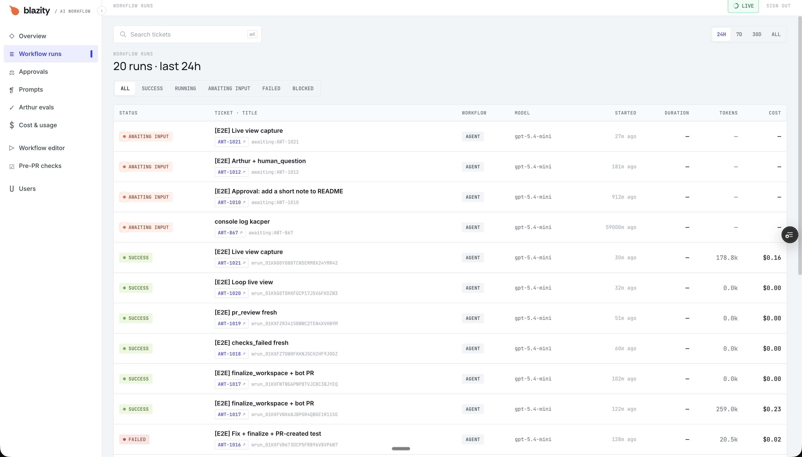
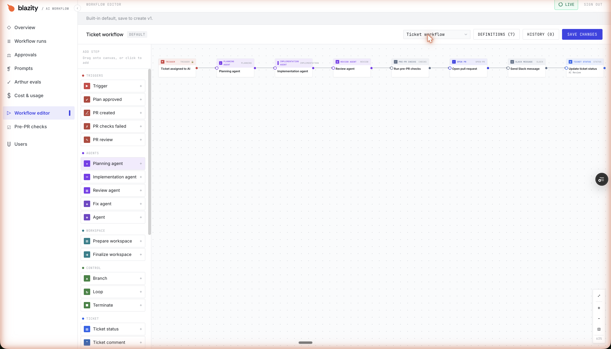
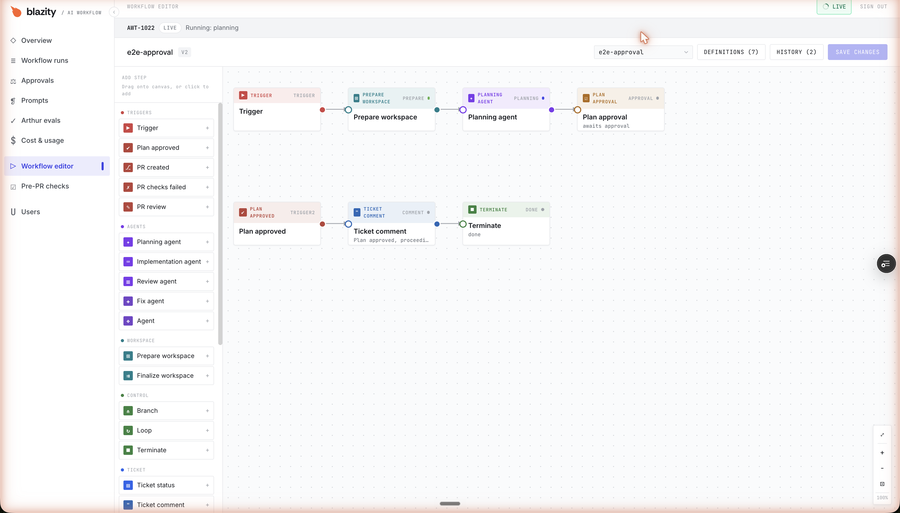
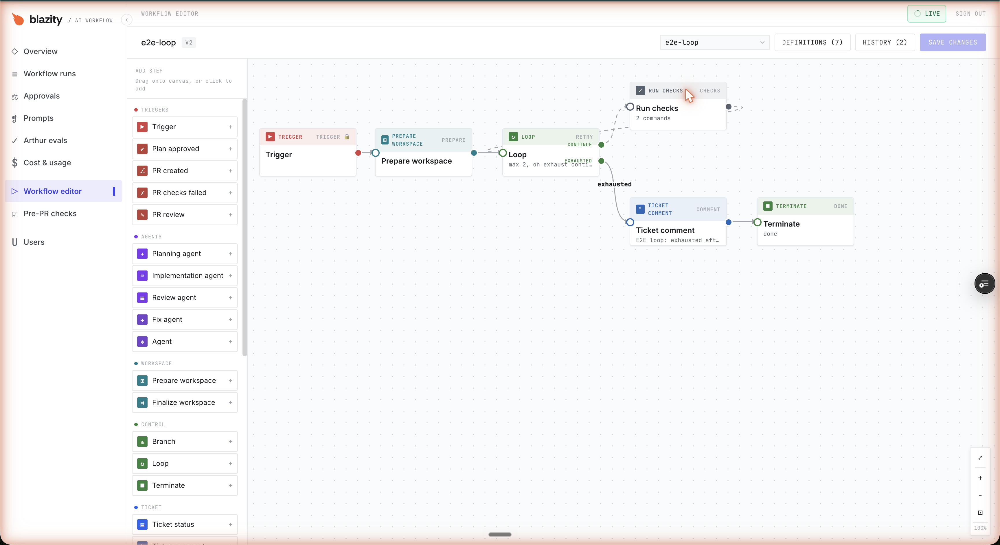
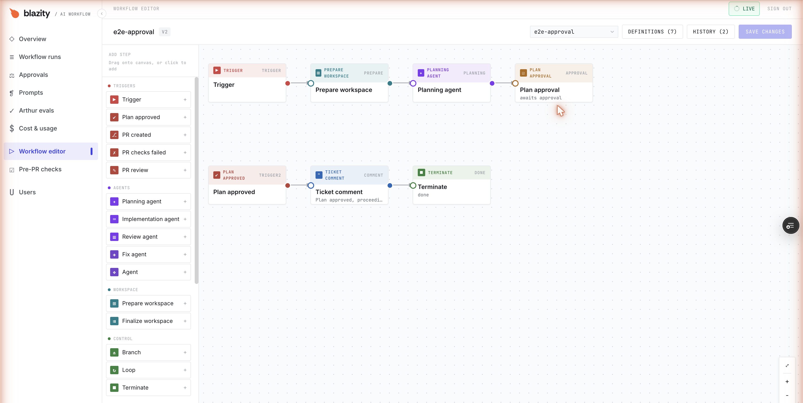
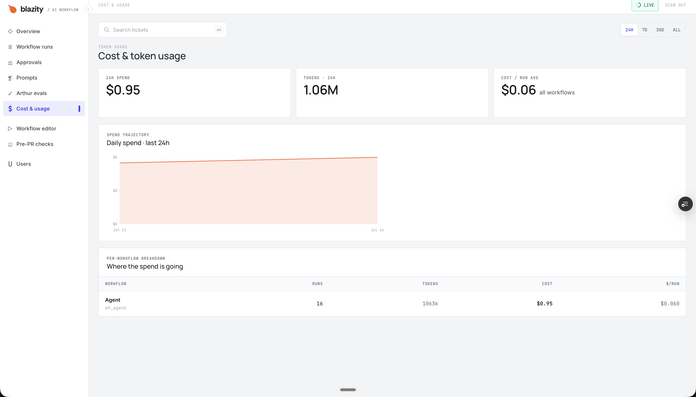

# AI Workflow — end-to-end test report

**Scope:** prove that every block in the graph-based workflow engine actually runs on a
real workflow, on real infrastructure, and that the agent traverses each step without
unexpected errors.

**Where:** the `ai-workflow-demo` preview deployment (never production).
**Model:** codex `gpt-5.4-mini`.
**Repository the agent operated on:** `Blazity/ai-workflow-demo` only (hard-enforced, see below).
**Date:** 2026-07-14.

**Headline result:** all **28** block types that existed on 2026-07-14 were exercised on real
runs. Every block reached its expected outcome (`ok`, or the intentional `awaiting_input` /
`warn` for the human-in-the-loop and approval steps, or a deliberate `fail` where we forced a
failure). Every run stayed on the demo repository. Two real bugs were found, and both are now
fixed and deployed.

> **Update (later on 2026-07-14).** After this report was written, commit `2d0912a` removed the
> `arthur_trace` block, so the engine now has **27** block types. `arthur_trace` was genuinely
> exercised here (see section 2) before it was removed; its row is retained below as the record.
> The coverage claim in current terms is **27/27**. The second bug (4b) has since been fixed too:
> see the update in that section.

---

## 1. What "verified" means here

Each block was put on a purpose-built workflow definition, that definition was enabled, and
a real trigger fired it: a Jira ticket moved into the "AI" column, a plan approved in the
dashboard, or a GitHub pull-request event (PR opened, a failing check, or a human review).

For every run we checked three things:

1. **The live per-step view.** The editor shows each block's status as the run progresses
   (`pending → running → ok`). The header names the step the agent is currently in, e.g.
   `Running: planning`. This is the "the agent is in this step" view.
   (see `evidence/05-live-running-planning.png`).
2. **The block-status API.** `GET /api/v1/runs/block-statuses?definitionId=<id>` returns each
   block's status and output, so the progression is verifiable programmatically, not just
   visually.
3. **The run telemetry.** Each finished run reports status, model, token usage, cost, and any
   PR it opened (`evidence/01-runs-table.png`, `evidence/07-cost.png`).

**Safety guardrail (verified on every run):** each run's workspace step reports the
repositories it selected, and in every case it was exactly `["github:Blazity/ai-workflow-demo"]`.
The bot cannot branch, push, or open a PR anywhere else — an allowlist
(`AGENT_ALLOWED_REPOS`) both filters repository discovery and hard-guards branch/PR creation.

---

## 2. Per-block results (28/28 at the time; 27/27 in current terms)

Result legend: **ok** = ran and completed; **parked (by design)** = intentionally pauses for a
human (approval / question); **fail (forced)** = we deliberately made it fail to prove the
error path. "Vehicle" is the test workflow that exercised the block.

### Triggers (5)

| Block | Vehicle / how it fired | Result | Evidence |
|---|---|---|---|
| `trigger_ticket_ai` | Ticket moved into "AI" (default pipeline + all test defs) | ok | every ticket run |
| `trigger_plan_approved` | Approving a plan in the dashboard dispatched the follow-up run | ok | `AWT-1015`, approval `evidence/06` |
| `trigger_pr_created` | Bot opened a PR (`blazebot/awt-1017` → PR #292) | ok | run `…38JYEQ`, PR #292 |
| `trigger_pr_checks_failed` | A failing check (`e2e-fail-1018`) on PR #293 | ok | run `…F9J0GZ`, `evidence/08` |
| `trigger_pr_review` | A human "request changes" review on PR #294 | ok | run `…XVHB9M`, PR #294 |

### Agents (5)

| Block | Vehicle | Result | Evidence |
|---|---|---|---|
| `planning_agent` | Default pipeline + approval flow | ok | `AWT-1021` live `evidence/05` |
| `implementation_agent` | Default pipeline + finalize flow | ok | run `…1R11SG` |
| `review_agent` | Default pipeline | ok | Tier-0 runs |
| `fix_agent` | Fix flow (ran the fix phase, reported "implemented") | ok | def `e2e-fix-finalize` |
| `generic_agent` (Agent) | Stress def with a concrete prompt | ok | stress run |

### Workspace (2)

| Block | Vehicle | Result | Evidence |
|---|---|---|---|
| `prepare_workspace` | Every run that touches a repo | ok | `__prepare` on every run |
| `finalize_workspace` | `implementation_agent → finalize_workspace` | ok — opened PR #292 | run `…1R11SG` |

### Control (3)

| Block | Vehicle | Result | Evidence |
|---|---|---|---|
| `branch` | Stress def | ok | stress run |
| `loop` | `e2e-loop`: looped `maxAttempts:2` then took the `exhausted` edge | ok | run `…XABZHCV9`, `evidence/04` |
| `terminate` | Ends most test defs (`done`) | ok | loop / approval / fix runs |

### Ticket, LLM, checks, PR I/O, approval, security (13)

| Block | Vehicle | Result | Evidence |
|---|---|---|---|
| `update_ticket_status` | Default pipeline (moves ticket to AI Review) | ok | Tier-0 runs |
| `post_ticket_comment` | LLM / loop / approval defs | ok | comment on `AWT-1014/1015` |
| `human_question` | HITL def — parked the ticket with the question | parked (by design) | `AWT-1012` (`awaiting_input`) |
| `call_llm` | LLM def (codex) | ok | LLM run |
| `run_checks` | Loop def ran `ls -la` + `echo` (twice, once per iteration) | ok | run `…XABZHCV9` |
| `run_pre_pr_checks` | Default pipeline | ok | Tier-0 runs |
| `open_pr` | Default pipeline | ok | Tier-0 PRs |
| `send_slack_message` | Default pipeline (posts when Slack is configured) | ok | Tier-0 runs |
| `send_plan_approval` | Approval def — parked with `awaiting_approval` + wrote an approval request | parked (by design) | run `…23E3T3`, `evidence/06` |
| `fetch_pr_context` | PR-trigger defs | ok | runs `…38JYEQ`, `…F9J0GZ`, `…XVHB9M` |
| `post_pr_comment` | PR-trigger defs — commented on the PR | ok | PR #292/#293/#294, `evidence/08` |
| `arthur_injection_check` | Arthur def — ran a real prompt-injection scan | ok (`status: ok`) | Arthur run |
| `arthur_trace` | Arthur def (task naming) | ok | Arthur run |

`arthur_trace` ran `ok` here and was **removed later the same day** by `2d0912a`; the row records
a real result for a block that no longer exists. The other 27 rows are all current blocks.

---

## 3. The live "agent is in this step" view

`evidence/05-live-running-planning.png` is the signature capture: the editor in **LIVE**
mode while `AWT-1021` runs. The header reads `AWT-1021 · LIVE · Running: planning`, the
`prepare_workspace` node shows a completed (green) dot, and `planning_agent` shows the active
dot. As the run advances, the dots move step by step. This is the real-time execution view
the product is meant to provide, confirmed working end to end.

The definition graphs render exactly as authored — for example the loop
shows the `continue` / `retry` / `exhausted` ports, and the approval definition shows both
chains (produce-a-plan and resume-after-approval).

---

## 4. Bugs and findings

### 4a. Fixed + deployed — case-sensitive webhook repository match
GitHub delivers the org name as `Blazity`, while the deployment configures `GITHUB_OWNER=blazity`
(lowercase). The webhook handler compared them case-sensitively, so **every** GitHub webhook for
the demo repo was silently dropped as "other repo" — which disabled all three PR triggers and the
post-PR gate. GitHub org/repo names are case-insensitive. Fixed to compare case-insensitively,
with a regression test; deployed to the demo. After the deploy, the same event that used to be
dropped dispatched a run correctly.

### 4b. Fixed + deployed: only the first PR trigger per ticket dispatched
A pull request can legitimately produce more than one trigger over its life (a failing check,
then a review). At the time of this report only the **first** PR trigger for a given ticket
dispatched; later ones were coalesced away. During testing we suspected a claim/verify race in
the dispatcher and worked around it by testing each PR trigger on a fresh ticket/PR.

**That workaround is obsolete, and the suspected cause was wrong.** The real root cause was that
a run which finished *without* traversing a block that unregisters (`open_pr`, `finalize_workspace`,
`send_plan_approval`, `terminate`, clarification or failure) left its `active_runs` row behind, so
the ticket's next PR trigger aborted at `claim()` and reported `coalesced`. `agentWorkflow`'s outer
`finally` now releases the row on every terminal exit. Fixed in `2d0912a`. Details and the
regression test in `e2e-findings.md §7b`.

### 4c. Note — `fix_agent` + `finalize_workspace` in a ticket-only flow
`fix_agent` runs and reports success, but agents don't always `git commit`, so in a ticket-only
flow `finalize_workspace` can find nothing to push. `implementation_agent` commits reliably, so
`implementation_agent → finalize_workspace` opens a PR cleanly (this is what produced PR #292).
`fix_agent`'s natural home is the PR-fix flow, where it is handed a real diff to act on.

---

## 5. Human approvals

When a run reaches `send_plan_approval` it parks and files the plan for a human decision. The
approvals screen lists each request and its outcome; here `AWT-1015` shows as approved (approving
it is what dispatched the follow-up `trigger_plan_approved` run).

All eight screenshots are in `evidence/` (see that folder's `README.md` for the file-to-caption
map): `01` runs list, `02` editor + palette, `03` approval graph, `04` loop graph,
`05` live run, `06` approvals, `07` cost, `08` PR checks-failed.

---

## 6. Cost

Over the test window the 16 agent runs used ~1.06M tokens for **$0.95** total — about **$0.06
per run** on codex `gpt-5.4-mini`. Cost is attributed per workflow and per run in the dashboard.

---

## 7. How to reproduce

1. On the `ai-workflow-demo` deployment, author a definition via
   `PUT /api/v1/workflow-definitions/{id}` with the block(s) under test, then enable it
   (`PATCH … {enabled:true}`); only one definition per trigger type can be enabled at a time.
2. Fire the trigger: move a Jira ticket in project `AWT` into the "AI" status, approve a plan
   via `POST /api/v1/approvals/{id}/approve`, or produce a GitHub PR event on `blazebot/awt-<n>`.
3. Watch the run in the editor (LIVE) or poll `GET /api/v1/runs/block-statuses?definitionId=<id>`
   for `pending → running → ok`, and read `GET /api/v1/runs` for status / model / cost / PR.
4. Confirm the run's workspace selected only `github:Blazity/ai-workflow-demo`.

For the PR triggers specifically: note that a `trigger_pr_review` run requires a **human** review,
the bot's own reviews are correctly filtered out. The "use a fresh ticket per trigger" step this
report originally required is **no longer needed** now that 4b is fixed: one ticket can take
several PR triggers over its life.

---

## 8. What is not covered live, and why

Nothing is uncovered: all 28 block types that existed at the time ran on real workflows (27 in
current terms, after `arthur_trace` was removed). The two intentional "pauses" (`human_question`,
`send_plan_approval`) are shown parking as designed, and the one `fail` (`finalize_workspace` with
no committed changes) is an intentional error-path check, not a defect. The dispatcher finding (4b)
did not block coverage: every PR trigger was proven on a fresh ticket, and that finding has since
been fixed.
